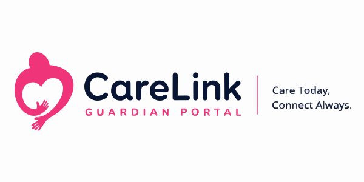

# CareLink Guardian Portal

**Project:** CareLink Guardian Portal  
**Subtitle:** Healthcare Operations & Family Care Management Platform  
**Version:** 1.1.0  
**Prepared By:** Lakshara Anand V V  
**Register Number:** RA2411003050128  
**Project Supervisor:** Dr. Rahmath Nisha  
**Academic Year:** 2026–2027  

---

# Document Metadata

| Field | Value |
| :--- | :--- |
| **Document Version** | 1.1.0 |
| **Last Updated** | 2026-07-04 |
| **Prepared By** | Lakshara Anand V V |
| **Reviewed By** | Dr. Rahmath Nisha |
| **Project** | CareLink Guardian Portal |
| **Document Type** | Repository README / Landing Page |

---

# Table of Contents
- [1. Banner](#1-banner)
- [2. Badges](#2-badges)
- [3. Table of Contents](#3-table-of-contents)
- [4. Project Status](#4-project-status)
- [5. Author](#5-author)
- [6. Project Description](#6-project-description)
- [7. Repository Overview](#7-repository-overview)
- [8. Problem Statement](#8-problem-statement)
- [9. Objectives](#9-objectives)
- [10. Key Features](#10-key-features)
- [11. Project Lifecycle](#11-project-lifecycle)
- [12. Project Timeline](#12-project-timeline)
- [13. Revision History](#13-revision-history)
- [14. Frontend Architecture](#14-frontend-architecture)
- [15. Application Workflow](#15-application-workflow)
- [16. Technology Stack](#16-technology-stack)
- [17. Installation](#17-installation)
- [18. Repository Structure](#18-repository-structure)
- [19. Documentation Index](#19-documentation-index)
- [20. Screenshots](#20-screenshots)
- [21. Community Connect Completion Certificate](#21-community-connect-completion-certificate)
- [22. Current Academic Scope](#22-current-academic-scope)
- [23. Future Enhancements](#23-future-enhancements)
- [24. License](#24-license)
- [25. Acknowledgements](#25-acknowledgements)

---

# 1. Banner

<p align="center">
  
</p>

<h1 align="center">CareLink Guardian Portal</h1>

<p align="center">
  <strong>Healthcare Operations & Family Care Management Platform</strong>
</p>

---

# 2. Badges

<p align="center">
  <a href="https://nextjs.org"></a>
  <a href="https://react.dev"></a>
  <a href="https://tailwindcss.com"></a>
  <a href="https://github.com/pmndrs/framer-motion"></a>
  <a href="https://www.chartjs.org"></a>
  <a href="https://developer.mozilla.org/en-US/docs/Web/API/IndexedDB_API"></a>
  <a href="https://developer.mozilla.org/en-US/docs/Web/Progressive_web_apps"></a>
  <a href="#project-status"></a>
  <a href="LICENSE"></a>
</p>

---

# 3. Table of Contents

The index of all 25 sections is defined in the [Table of Contents](#table-of-contents) above.

---

# 4. Project Status

| Metric | Current Status |
| :--- | :--- |
| **Development Phase** | Completed (Production-Ready Frontend Dashboard Shell) |
| **Academic Target** | B.Tech Capstone Project (Academic Year 2026–2027) |
| **Live Demonstration** | [https://carelink.kuralarawebflux.com](https://carelink.kuralarawebflux.com) |
| **Validation Base** | Renaissance Trust, Ammapet, Salem (Community Connect) |
| **Compilation Shell** | Next.js 15 (App Router, Turbopack) |
| **Client Storage** | IndexedDB version 4 database (`carelink-db`) + LocalStorage state keys |

---

# 5. Author

| Academic Attribute | Details |
| :--- | :--- |
| **Student Name** | Lakshara Anand V V |
| **Register Number** | RA2411003050128 |
| **Degree Program** | Bachelor of Technology (B.Tech) |
| **Department** | Computer Science and Engineering |
| **Institution** | SRM Institute of Science and Technology, Tiruchirappalli Campus |
| **Academic Year** | 2026–2027 |
| **Project Supervisor** | Dr. Rahmath Nisha (Assistant Professor) |

---

# 6. Project Description

CareLink Guardian Portal is a modern, client-side Progressive Web Application (PWA) designed to improve operational coordination in residential eldercare facilities. The platform bridges the communication gap in senior living environments by integrating facility administrators, clinical caregivers, and family members (guardians) into a unified, role-isolated web interface. 

To maintain operational continuity during network disruptions, the portal incorporates localized caching and queuing mechanisms. Clinical task logs, vitals records, and resident profiles are managed in browser thread memory (React Context), serialized to LocalStorage, and prepared for cloud synchronization using a structured client database schema (IndexedDB). While the frontend functions independently as an academic project with pre-populated datasets, its integration services client is structured to connect with remote cloud gateways, such as the WelfareSync Engine backend.

---

# 7. Repository Overview

This repository holds the complete source code, development configurations, design blueprints, and validation assets for the CareLink Guardian Portal:
*   **Purpose of the Repository:** Serve as the definitive codebase, design baseline, and academic portfolio for the B.Tech project submission, detailing modern web engineering practices.
*   **Intended Audience:** Academic evaluators reviewing capstone deliverables, students studying Progressive Web App design, software developers seeking to integrate IndexedDB/Context persistence, and recruiters assessing technical portfolios.
*   **Relationship between Project, Documentation, and Implementation:** The code implementation (`src/`) matches the specifications defined in the Software Requirements (SRS) and High-Level/Low-Level designs (`docs/`). System layouts are verified against QA testing logs (`TESTING_REPORT.md`), and the entire process is validated in the community connect reports (`FINAL_PROJECT_REPORT.md`).

---

# 8. Problem Statement

Residential care facilities operate under complex coordination schedules involving medical supervisors, shift caretakers, and residents' families. Traditional software solutions in this domain suffer from:
1.  **Communication Gaps**: Administrative registries, caregiver duty logs, and family updates exist in isolated systems, leaving guardians without clear visibility.
2.  **Network Dropouts**: Cloud-only platforms become unusable during internet drops, preventing caregivers from checking off tasklists or logging critical vitals in real time.
3.  **Role Overlap**: Generic layouts that mix clinical operations with operational setups increase user learning curves and introduce security risks.

CareLink Guardian Portal resolves these issues by caching application assets and clinical data in the browser sandbox. The responsive web dashboard remains functional during outages, queuing changes locally, and syncing them automatically when connectivity returns.

---

# 9. Objectives

The primary engineering and educational goals of this project are:
*   **Decoupled Frontend Shell**: Design a client-side interface that boots and functions independently of active database servers.
*   **Role-Isolated Security**: Wrap workspace routes in protective boundaries (`ProtectedRoute.jsx`) to enforce access scopes for administrators, caregivers, and guardians.
*   **Layered Caching Persistence**: Implement a dual-tier client storage model coordinating synchronous session variables (LocalStorage) with transactional object stores (IndexedDB).
*   **Health Analytics Visualization**: Develop client-side data trend graphs using Chart.js to map historical vitals metrics (blood pressure, sugar, oxygen).
*   **Empirical Community Validation**: Field-test the system's usability and sync outbox resilience under volunteer care conditions at a partnering social welfare trust.

---

# 10. Key Features

### Administrator Features
*   **Demographic Registry**: CRUD tools to admit residents, assign staff, link guardians, and archive records.
*   **Global Operations Logs**: System audit tables tracking logins, edits, and configuration updates.
*   **Variables Configuration**: Controls to toggle simulated network latencies and backend database failures.

### Caregiver Features
*   **Clinical checklists**: Touch-friendly checklists for daily Medication, Nutrition, Hygiene, and Mobility tasks.
*   **Vitals Entry Form**: Structured input fields for Blood Pressure, Blood Sugar, SpO2, Pulse, and Temp.
*   **Clinical Boundary Checks**: Real-time evaluation of vitals inputs to trigger warnings for abnormal ranges (e.g. hyper/hypotension).
*   **Handover Logs**: Shift notes logs to record caregiver observations.

### Guardian Features
*   **Wellness Index Summary**: Real-time display of resident care completion rates.
*   **Vital Sign Charts**: Tabbed Chart.js canvas lines tracking glucose spikes and oxygen levels.
*   **Activity Timeline**: Read-only timeline displaying completed caregiver checklists.

### Platform Features
*   **Outbox Synchronizer (`careLinkSyncEvents`)**: Offline event queuing system that caches transactions during network drops and schedules them for sync.
*   **Service Worker Caching**: Shell caching registration (`sw.js`) that caches stylesheets, icons, fonts, and script bundles.
*   **Responsive Viewport Scaling**: Layout optimized across mobile screens, tablets, and widescreen displays.

---

# 11. Project Lifecycle

The ASCII flow diagram below traces the engineering pipeline followed from the initial NGO visit to the final GitHub release:

```text
       NGO Visit (Renaissance Trust)
                     │
                     ▼
           Requirement Gathering
                     │
                     ▼
             Problem Analysis
                     │
                     ▼
             Solution Proposal
                     │
                     ▼
               UI/UX Design
                     │
                     ▼
               System Design
                     │
                     ▼
                Development
                     │
                     ▼
                  Testing
                     │
                     ▼
                Deployment
                     │
                     ▼
             NGO Demonstration
                     │
                     ▼
       Community Connect Completion (20 June)
                     │
                     ▼
        Post-Deployment Improvements
                     │
                     ▼
            Final Documentation
                     │
                     ▼
               GitHub Release
```

---

# 12. Project Timeline

### 12.1 Visual Project Roadmap
The flowchart below maps the transition from field implementation under the Community Connect Programme to post-completion independent software refinement:

```text
   Community Connect Programme
      (01–20 June 2026)
  
        NGO Visit
            │
            ▼
      Requirement Analysis
            │
            ▼
      Problem Identification
            │
            ▼
      Solution Proposal
            │
            ▼
        UI/UX Planning
            │
            ▼
        System Design
            │
            ▼
         Development
            │
            ▼
      Testing & Validation
            │
            ▼
      Deployment Preparation
            │
            ▼
       NGO Demonstration
            │
            ▼
   Community Connect Completion
            │
            ▼
  
   Independent Software Refinement
      (21 June–02 July 2026)
  
      Documentation Refinement
            │
            ▼
      Software Optimization
            │
            ▼
    Repository Standardization
            │
            ▼
     Final Academic Submission
            │
            ▼
         GitHub Release
```

### 12.2 Phased Project Timeline Table

| Date | Phase | Description |
| :--- | :--- | :--- |
| **01 June 2026** | Community Connect Initiation | Visited Renaissance Trust, Ammapet, Salem to understand existing workflows, observe caregiver operations, and study manual record-keeping practices. |
| **02 June 2026** | Requirement Analysis | Gathered functional and non-functional requirements through discussions with caregivers and management. |
| **03 June 2026** | Problem Identification | Analyzed operational challenges, communication gaps, and opportunities for digital transformation. |
| **04 June 2026** | Solution Proposal | Proposed the CareLink Guardian Portal as a Healthcare Operations & Family Care Management Platform. |
| **05 June 2026** | UI/UX Planning | Designed user flows, wireframes, dashboard layouts, and role-based interfaces. |
| **06 June 2026** | System Design | Finalized frontend architecture, routing, state management, and browser storage strategy. |
| **07–10 June 2026** | Core Development | Implemented authentication, dashboards, resident management, caregiver workspace, and guardian portal. |
| **11–14 June 2026** | Feature Development | Completed analytics, reports, notifications, responsive layouts, charts, and reusable UI components. |
| **15–17 June 2026** | Testing & Validation | Performed functional testing, browser compatibility testing, responsive testing, and usability improvements. |
| **18 June 2026** | Deployment Preparation | Prepared production build, PWA configuration, application assets, and deployment setup. |
| **19 June 2026** | Project Demonstration | Demonstrated the completed application at Renaissance Trust and incorporated final implementation feedback. |
| **20 June 2026** | Community Connect Completion | Successfully completed the Community Connect Programme and received the official completion certificate from Renaissance Trust. |
| **21–24 June 2026** | Documentation Refinement | Improved project documentation, technical reports, diagrams, and GitHub repository content based on the completed implementation. |
| **25–28 June 2026** | Software Refinement | Fixed minor UI issues, optimized application performance, improved accessibility, and enhanced user experience. |
| **29 June–02 July 2026** | Final Repository Preparation | Standardized documentation, completed repository organization, resolved post-deployment software issues, and finalized the project for academic submission and public GitHub release. |

---

# 13. Revision History

The table below catalogs the revision history of the CareLink Guardian Portal repository:

| Version | Date | Author | Description / Major Milestone Completed |
| :--- | :--- | :--- | :--- |
| **v0.1** | 01 June 2026 | Lakshara Anand V V | **Project proposal**: Initial requirements gathering, research on PWA capabilities, and project layout mapping. |
| **v0.2** | 02 June 2026 | Lakshara Anand V V | **Requirement analysis**: Completion of requirements catalog, functional use cases definition, and initial draft of SRS.md. |
| **v0.3** | 05 June 2026 | Lakshara Anand V V | **UI Design**: Visual layouts definition, Material Design 3 variables configuration, and CSS token setups in globals.css. |
| **v0.4** | 07 June 2026 | Lakshara Anand V V | **Core implementation**: Directory structure creation, App Router layout wraps, and React Context auth provider setups. |
| **v0.5** | 11 June 2026 | Lakshara Anand V V | **Feature completion**: Integrated caregivers tasks check boards, vitals logger forms, and Chart.js reporting charts. |
| **v0.6** | 15 June 2026 | Lakshara Anand V V | **Testing**: Manual verification runs, browser rendering checks, outbox sync test cases, and initial testing report. |
| **v1.0** | 20 June 2026 | Lakshara Anand V V | **Community Connect completion**: Field trails validation at Renaissance Trust and receipt of the completion certificate. |
| **v1.0.1**| 25 June 2026 | Lakshara Anand V V | **Documentation improvements**: Standardized technical logs, detailed sequence charts, and index matrix. |
| **v1.0.2**| 28 June 2026 | Lakshara Anand V V | **UI improvements**: Enhanced mobile responsive grids, keyboard focus highlights, and form input sanitization checks. |
| **v1.0.3**| 01 July 2026 | Lakshara Anand V V | **Repository cleanup**: Deleted unused scripts, optimized image asset weights, and finalized project tree. |
| **v1.1.0**| 02 July 2026 | Lakshara Anand V V | **Final release**: Rebuild static site shells, standardized index tables, and finalized codebase for academic submission. |

---

# 14. Frontend Architecture

The architecture relies on a client-side State Context Provider (`DashboardContext.jsx`) operating in the browser thread. It manages data mutations, updates IndexedDB database instances, and coordinates views.

```
+-----------------------------------------------------------------------------+
|                               Browser Window                                |
+-----------------------------------------------------------------------------+
                                       |
                                       v
+-----------------------------------------------------------------------------+
|                    PWA Service Worker & Manifest Cache                      |
|                (Caches App Frame, CSS, JS, and Assets Offline)               |
+-----------------------------------------------------------------------------+
                                       |
                                       v
+-----------------------------------------------------------------------------+
|                        Next.js App Router Layouts                           |
|             (Page Shells, Navigation Sidebar, & Active Wrappers)             |
+-----------------------------------------------------------------------------+
                                       |
                                       v
+-----------------------------------------------------------------------------+
|                      Protected Route Guard Boundary                         |
|                 (Validates Session Role & Access Scopes)                    |
+-----------------------------------------------------------------------------+
                                       |
                                       v
+-----------------------------------------------------------------------------+
|                 Dashboard State Context Provider (React 19)                 |
|       (Central State Manager, Data Mutation, and Change Propagation)        |
+-----------------------------------------------------------------------------+
            /                          |                          \
           /                           |                           \
          v                            v                            v
+------------------+         +-------------------+         +------------------+
| Storage Services |         |   Mock API Layer  |         | Presentation UI  |
| - LocalStorage   |         | (careLinkApiClient|         | - Workspace Views|
| - IndexedDB      |         |  & Seed Datasets) |         | - Chart.js Trends|
|   (carelink-db)  |         | - Event Outbox    |         | - MD3 Components |
+------------------+         +-------------------+         +------------------+
```

---

# 15. Application Workflow

The sequence below details the authentication, database storage updates, and the synchronization outbox loop:

```
[ User Action ] ───> [ Login Page (/login) ] ───> Workspace Category Selection
                                                          |
                                                          v
                                               Credentials Check (auth.js)
                                                          |
                                               +----------+----------+
                                               |                     |
                                            [Valid]              [Invalid]
                                               |                     |
                                               v                     v
                                      Save session token      Render validation
                                      to LocalStorage             error UI
                                               |
                                               v
                                     Route Redirect Guards
                                  (/admin, /caregiver, /guardian)
                                               |
                                               v
                                     Initialize Dashboard
                                     State Context Layer
                                               |
                          +--------------------+--------------------+
                          |                                         |
                    [Online Mode]                             [Offline Mode]
                          |                                         |
               Dispatch request to API                    Log event locally as PENDING
              & commit local database                     Write to careLinkSyncEvents
                          |                                         |
                          v                                         v
                Update workspace views                     Wait for Network Connection
               with synced state records                   & User Sync Trigger (Manual)
                          |                                         |
                          |                                         v
                          |                              Execute outbox queue runner
                          |                              (Push events sequentially)
                          |                                         |
                          |                                         v
                          |                              On success, mark events
                          |                              as SYNCED in IndexedDB
                          |                                         |
                          +--------------------+--------------------+
                                               |
                                               v
                                   Render Interactive Views
                              (Vitals Charts & Handover Timeline)
```

---

# 16. Technology Stack

The details of the technology stack and their selection rationales are outlined below:

| Technology | Reference Version | Role in Architecture | Technical Selection Rationale |
| :--- | :--- | :--- | :--- |
| **Next.js 15** | `15.0.x` (App Router) | Structural Framework | Modern React framework selected for its App Router architecture to define file-based routing layouts, Turbopack compilation to minimize local load delays, and build optimization capabilities to bundle static shells. |
| **React 19** | `19.0.x` | UI & State Library | Component-based UI library selected to build modular, reusable, and maintainable user interfaces using hooks and Context API for client state management without Redux dependency overhead. |
| **Tailwind CSS v4** | `v4.0.x` | Design Styling | Utility-first CSS framework chosen to compile design tokens and styling themes directly at build-time, reducing runtime stylesheets weight and standardizing MD3 visual parameters. |
| **Framer Motion** | `v11.x` | Layout Animations | Interactive animation library selected to orchestrate fluid layout transitions, dashboard panel slides, and modal overlays that eliminate harsh browser page jumps. |
| **Chart.js** | `v4.x` | Analytics Engine | Data visualization engine chosen to render dynamic, responsive line and bar graphs using high-performance HTML5 canvas objects that load instantly on mobile devices. |
| **IndexedDB** | `Version 4` Schema | Persistent Data Layer | Asynchronous browser database selected to store complex structured datasets (such as resident medical history and sync events outbox) exceeding standard LocalStorage memory limits. |
| **LocalStorage** | Native Web API | Session Cache Cache | Browser key-value cache chosen for its synchronous read execution, which instantly hydrates auth sessions (`carelinkUser`) to resolve route protection checks before page rendering. |
| **Progressive Web App** | W3C Specification | App Context | Web app standard chosen to configure the portal to run installable as a native standalone application on mobile and desktop platforms. |
| **Service Worker** | `sw.js` | Asset Cache Manager | Offline cache worker selected to intercept network fetch calls and serve static resources from local browser storage, allowing the dashboard shell to load offline. |

---

# 17. Installation

Follow these steps to set up the development environment and run the CareLink Guardian Portal locally:

### 17.1 Prerequisites
*   **Node.js**: Version `18.x` or higher (v20+ recommended).
*   **Package Manager**: `npm` (pre-bundled with Node.js).

### 17.2 CLI Instructions
1.  **Clone the Repository**:
    ```bash
    git clone https://github.com/your-username/carelink-guardian-portal.git
    cd carelink-guardian-portal
    ```
2.  **Install Dependencies**:
    ```bash
    npm install
    ```
3.  **Run Development Server**:
    ```bash
    npm run dev
    ```
    Open [http://localhost:3000](http://localhost:3000) inside your browser.
4.  **Build Production Package**:
    ```bash
    npm run build
    ```
5.  **Run Production Server Locally**:
    ```bash
    npm run start
    ```

---

# 18. Repository Structure

The modular workspace layout details files and directories:

```text
carelink-guardian-portal/
├── docs/                             # Academic documentation files
│   ├── certificates/                 # Certificate reference directory
│   │   ├── README.md                 # Community Connect Certificate explanation
│   │   └── community_connect_certificate.png # Reserved for official certificate image
│   ├── screenshots/                  # Image assets showing application views
│   │   ├── admin_dashboard.png       # Administrator operations control panel
│   │   ├── beta_workspace.png        # Evaluator sandbox testing environment
│   │   ├── caregiver_dashboard.png   # Caregiver daily checklist workspace
│   │   ├── guardian_dashboard.png    # Family health tracking panel
│   │   ├── home_png.png              # Application landing page
│   │   ├── login1.png                # Security login workspace selection
│   │   ├── login2.png                # Security credentials entry screen
│   │   ├── mobile_responsive.png     # Smartphone layout viewport demonstration
│   │   ├── notifications.png         # Active alerts and status triggers
│   │   ├── reports.png               # CSV and data export console
│   │   └── settings.png              # Global application configuration panel
│   ├── *.md                          # Standardized design and verification logs
└── src/                              # Source directory
    ├── app/                          # Next.js App Router Root
    │   ├── components/               # Composite UI Modules
    │   │   └── ui/                   # Reusable UI widgets
    │   ├── utils/                    # Core utilities
    │   ├── layout.js                 # Global page header and layout wrappers
    │   └── page.js                   # Application public landing page
    └── services/                     # Background services layer
        ├── indexedDb.js              # Database helper class
        └── careLinkApi.js            # Simulated CareLink API layer
```

---

# 19. Documentation Index

The table below catalogs all project documentation files inside the `docs/` folder:

| Document Name | Purpose | Target Audience |
| :--- | :--- | :--- |
| [SRS.md](docs/SRS.md) | Formulates functional requirements, actor profiles, and system limitations. | Developers, Evaluators |
| [HLD.md](docs/HLD.md) | Specifies subsystem architectural layouts and navigation sequence flows. | System Architects, Reviewers |
| [LLD.md](docs/LLD.md) | Documents class schemas, mutator functions, and clinical risk algorithms. | Developers, Code Reviewers |
| [UI_UX_DESIGN.md](docs/UI_UX_DESIGN.md) | Details MD3 variable mappings, typography, and viewport media query rules. | UI/UX Designers, Frontend Devs |
| [FRONTEND_ARCHITECTURE.md](docs/FRONTEND_ARCHITECTURE.md) | Reviews directory trees, layouts routing, and component boundaries. | System Architects, Developers |
| [COMPONENT_DOCUMENTATION.md](docs/COMPONENT_DOCUMENTATION.md) | Lists props APIs and interface parameter checks for reusable UI widgets. | Frontend Developers, Testers |
| [ROUTING_DOCUMENTATION.md](docs/ROUTING_DOCUMENTATION.md) | Outlines routes access matrix and protected redirect sequence check loops. | Security Reviewers, Developers |
| [STATE_MANAGEMENT.md](docs/STATE_MANAGEMENT.md) | Explains context state provider structures and cache serialization lifecycles. | Developers, Evaluators |
| [LOCAL_STORAGE_DESIGN.md](docs/LOCAL_STORAGE_DESIGN.md) | Details IndexedDB versions, store settings, and outbox event schemas. | Database Engineers, Developers |
| [API_INTEGRATION.md](docs/API_INTEGRATION.md) | Specifications for request headers, latency injection, and offline retry logic. | Backend Integrators, Testers |
| [AUTHENTICATION_AUTHORIZATION.md](docs/AUTHENTICATION_AUTHORIZATION.md) | Traces session credentials, auth hydration, and route guards. | Security Reviewers, Developers |
| [DEPLOYMENT_GUIDE.md](docs/DEPLOYMENT_GUIDE.md) | Commands for code compilation, PWA bundles, and static hosting setups. | DevOps Engineers, Testers |
| [TESTING_REPORT.md](docs/TESTING_REPORT.md) | Records verification test cases outcomes and browser compatibility lists. | QA Engineers, Evaluators |
| [PROJECT_STRUCTURE.md](docs/PROJECT_STRUCTURE.md) | Provides an overview of folder directories and code modular divisions. | Developers, Evaluators |
| [ARCHITECTURE_REPORT.md](docs/ARCHITECTURE_REPORT.md) | Summarizes architectural decision records (ADRs) and scaling strategies. | System Architects, Evaluators |
| [USER_MANUAL.md](docs/USER_MANUAL.md) | User guides and walkthrough actions for Admins, Caregivers, and Guardians. | Care Volunteers, Evaluators |
| [VIVA_PREPARATION.md](docs/VIVA_PREPARATION.md) | Anticipated defense questions and terminology reference guides. | Student Developer, Evaluators |
| [FINAL_PROJECT_REPORT.md](docs/FINAL_PROJECT_REPORT.md) | Detailed capstone thesis structured in chapters for graduation review. | Academic Evaluation Panel |

---

# 20. Screenshots

The verification screen captures are grouped into logical operational categories below:

### 20.1 Authentication & Landing
*   **Ecosystem Landing View**: [home_png.png](docs/screenshots/home_png.png) - Public landing layout showcasing portal features.
*   **Workspace Selector Page**: [login1.png](docs/screenshots/login1.png) - Login category options page.
*   **Secure Credentials Form**: [login2.png](docs/screenshots/login2.png) - Scoped credential entry forms.

### 20.2 Administrator Workspace
*   **Admin Dashboard Summary**: [admin_dashboard.png](docs/screenshots/admin_dashboard.png) - Global operations panel.
*   **Resident Directory Table**: [residents.png](docs/screenshots/residents.png) - Resident record CRUD tables.

### 20.3 Caregiver Workspace
*   **Caretaker Task Checklist**: [caregiver_dashboard.png](docs/screenshots/caregiver_dashboard.png) - Daily clinical checklists board.

### 20.4 Guardian Workspace
*   **Guardian Wellness Panel**: [guardian_dashboard.png](docs/screenshots/guardian_dashboard.png) - Trend visualization dashboards.

### 20.5 Reports & Analytics
*   **CSV Exports Panel**: [reports.png](docs/screenshots/reports.png) - Tabular clinical logging exporter module.

### 20.6 Notifications
*   **Incident Alerts List**: [notifications.png](docs/screenshots/notifications.png) - Alerts and status warnings log console.

### 20.7 Settings
*   **Settings Panel Toggles**: [settings.png](docs/screenshots/settings.png) - Latency simulation configuration parameters page.

### 20.8 Mobile Responsive Layout
*   **Mobile Viewport Scaling**: [mobile_responsive.png](docs/screenshots/mobile_responsive.png) - Smartphone layout collapsed sidebar.

### 20.9 Beta Workspace
*   **Beta Sandbox Slate**: [beta_workspace.png](docs/screenshots/beta_workspace.png) - Empty validation testing sandbox.

---

# 21. Community Connect Completion Certificate

The CareLink Guardian Portal was successfully field-tested and validated under the Community Connect Programme. The user requirements, caregiver mobile checklists, and health visualization charts were validated in collaboration with **Renaissance Trust, Ammapet, Salem**.

Upon successful validation, an official completion certificate was issued by the trust. The path below is reserved for the official certificate image asset:

*   **Reserved Path:** [docs/certificates/community_connect_certificate.png](docs/certificates/community_connect_certificate.png)
*   **Documentation Context:** [docs/certificates/README.md](docs/certificates/README.md)

This completion certificate serves as empirical evidence of the project's practical implementation and successful community engagement.

---

# 22. Current Academic Scope

As an academic prototype, the application operates under specific technical guidelines:
*   **Client Context execution**: Operations are processed in-browser. State changes are serialized to browser cache storage.
*   **Simulated Connections**: The API integration client mimics network checks and latency options. This permits testing without live server configurations.
*   **Static Seed Data**: Includes static resident profiles and caregiver files to run the prototype upon boot.

---

# 23. Future Enhancements

The following roadmap is planned to transition the prototype into a production platform:
1.  **Live Backend Integration**: Connect API client requests to live endpoints hosted on the WelfareSync Engine backend.
2.  **Server JWT Auth**: Replace local session verification with server-signed JSON Web Token checks.
3.  **Real-Time Data Channels**: Integrate WebSockets to sync caregiver checklist markings to admin consoles instantly.
4.  **Hardware Vitals Capture**: Connect digital health oximeters and blood pressure devices using the Web Bluetooth API.
5.  **Push Alerts**: Use the Web Push API to send notifications directly to caretaker devices.

---

# 24. License

This project is licensed under the MIT License - see the [LICENSE](LICENSE) file for details.

---

# 25. Acknowledgements

*   **SRM Institute of Science and Technology, Tiruchirappalli Campus**: For providing research facilities and academic support.
*   **Department of Computer Science and Engineering**: For project guidance.
*   **Dr. Rahmath Nisha (Project Supervisor)**: For technical reviews, design feedback, and continuous support.
*   **Renaissance Trust, Ammapet, Salem**: For providing caregiver validation opportunities and issuing the completion certificate.
*   **The Open Source Community**: For Next.js, React, Tailwind, Framer Motion, and Chart.js documentation files and tools.
