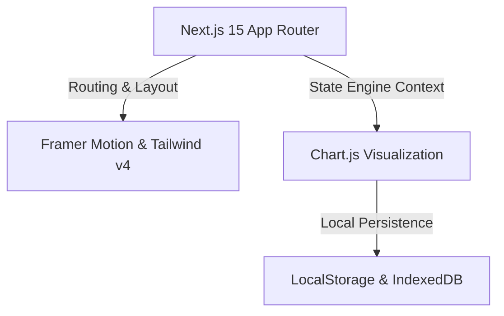

# Architectural Decisions and Rationale

**Project:** CareLink Guardian Portal  
**Subtitle:** Healthcare Operations & Family Care Management Platform  
**Version:** 1.0  
**Prepared By:** Lakshara Anand V V  
**Register Number:** RA2411003050128  
**Project Supervisor:** Dr. Rahmath Nisha  
**Academic Year:** 2026–2027  

---

# Document Metadata

| Field | Value |
| :--- | :--- |
| **Document Version** | 1.0 |
| **Last Updated** | 2026-07-04 |
| **Prepared By** | Lakshara Anand V V |
| **Reviewed By** | Dr. Rahmath Nisha |
| **Project** | CareLink Guardian Portal |
| **Document Type** | Architectural Decisions Report |

---

# Table of Contents
- [1. Introduction](#1-introduction)
- [2. Objectives](#2-objectives)
- [3. Scope](#3-scope)
- [4. Main Content](#4-main-content)
  - [4.1 Architectural Goals](#41-architectural-goals)
  - [4.2 Technology Selection Rationale](#42-technology-selection-rationale)
  - [4.3 Architectural Decision Records (ADRs)](#43-architectural-decision-records-adrs)
  - [4.4 Scalability \& Performance Strategy](#44-scalability--performance-strategy)
- [5. Summary](#5-summary)
- [6. Conclusion](#6-conclusion)
- [Author](#author)
- [Project Supervisor](#project-supervisor)

---

# 1. Introduction

## 1.1 Purpose
This document provides the Architectural Decisions and Rationale for the CareLink Guardian Portal application. It outlines the core architectural goals, technical selection rationales, Architectural Decision Records (ADRs), and system scaling strategies.

## 1.2 Scope
The scope of this report covers the frontend app architecture, user-interface engines, state contexts, data caching models, access guards, and assets optimizations.

## 1.3 Intended Audience
This architectural review is prepared for project architects, backend designers, academic supervisors, and system panel evaluators.

## 1.4 Relationship to the Overall Project
The Architecture Report records the high-level design decisions (HLD) and low-level code choices (LLD) in a formalized Architectural Decision Record (ADR) framework, outlining implementation rationales.

---

# 2. Objectives

The primary engineering objectives of this architectural report are:
- Document the four architectural goals of visual empathy, offline resilience, client security, and performance.
- Chart the relationship between App Router routing, Tailwind styling, Framer transitions, Chart.js visuals, and IndexedDB local caches.
- Formalize ADRs for client context state engine, layered caching, and route protection guards.
- Formulate component-level rendering optimizations and data-pruning scalability plans.

---

# 3. Scope

This architectural specification is bounded by the client-side system boundaries:
- **Included:** System goals, technology rationales, ADR entries, and client optimization strategies.
- **Excluded:** Enterprise cloud database replication protocols or backend server deployment architectures.

---

# 4. Main Content

## 4.1 Architectural Goals
The CareLink Guardian Portal architecture was designed to meet four core technical goals:
1.  **Empathetic & Responsive UI**: Implementing a Material Design 3 design system with transitions and animations.
2.  **Offline Resilience**: Enabling complete access to registries, health logs, and checklists without active internet access.
3.  **Strict Client-Side Security**: Enforcing role-based boundaries on data visibility and routing in the browser.
4.  **Performance**: Minimizing layout shifts and loading times using client-side state hydration.

## 4.2 Technology Selection Rationale

*   **Next.js 15 (App Router)**: Enforces modular file structures while enabling fast client-side navigation.
*   **Tailwind CSS v4**: Provides compile-time CSS utility processing, allowing custom styling through `@theme inline` tokens.
*   **Framer Motion**: Enables custom page transitions to replace default browser page loads.
*   **Chart.js**: Utilizes HTML5 canvas elements to render visual graphs on the client.
*   **LocalStorage & IndexedDB**: LocalStorage provides simple session caching, while IndexedDB provides a structured local database schema for offline access.

## 4.3 Architectural Decision Records (ADRs)

### 4.3.1 ADR 1: Client-Side Context Engine over Remote Orchestrators
*   **Context**: The portal must support offline access and immediate state updates.
*   **Decision**: Centralize all data modification logic in a React Context Provider (`DashboardContext.jsx`). All additions, archiving, and vital logging occur in browser memory and save instantly to the local cache.
*   **Consequences**: Fast updates, zero database query delay, and complete offline capability.

### 4.3.2 ADR 2: Layered Caching (LocalStorage & IndexedDB)
*   **Context**: The app requires simple state serialization alongside structured schemas for offline logging.
*   **Decision**:
    *   Use **LocalStorage** (`carelink_sprint_4_17_state`) for active state changes.
    *   Define an **IndexedDB** (`carelink-db` version 4) schema with seven object stores for local PWA database caching.
*   **Consequences**: Combines simple persistence with structured data schemas for offline coordination.

### 4.3.3 ADR 3: Client Route Guards (`ProtectedRoute`)
*   **Context**: The portal has strict role scopes (Admin, Caregiver, Guardian).
*   **Decision**: Protect routes at the component boundary. Wrap layouts in a `<ProtectedRoute requiredRole="...">` guard that redirects unauthenticated users or blocks unauthorized role changes.
*   **Consequences**: Restricts access without requiring remote backend authorization checks on every navigation event.

## 4.4 Scalability & Performance Strategy
*   **Component Isolation**: Splitting components into atomic UI modules (`src/app/components/ui/`) and composite modules keeps the codebase maintainable.
*   **Asset Optimization**: Service worker caching and SVG-based iconography (`react-icons/lu`) reduce file sizes and network dependencies.
*   **Data Pruning**: Microtasks optimize cache reads during initial page loads.

---

# 5. Summary

This Architectural Decisions and Rationale document outlines the system architecture of the CareLink Guardian Portal. It contains the core system goals, technology rationales, ADR entries for contexts, caches, and guards, and details system performance strategies.

---

# 6. Conclusion

Establishing a clear frontend architectural blueprint ensures that the CareLink Guardian Portal remains modular, secure, and resilient under poor network conditions. Leveraging browser context states, client-side route guards, and local databases yields a responsive experience suitable for residential healthcare settings.

---

## Author

**Lakshara Anand V V**  
Bachelor of Technology  
Computer Science and Engineering  
SRM Institute of Science and Technology  
Tiruchirappalli Campus  
Academic Year: 2026–2027  

---

## Project Supervisor

**Dr. Rahmath Nisha**  
Assistant Professor  
Department of Computer Science and Engineering  
SRM Institute of Science and Technology  
Tiruchirappalli Campus  

---

CareLink Guardian Portal  
Healthcare Operations & Family Care Management Platform  
© 2026 Lakshara Anand V V  
SRM Institute of Science and Technology  
Tiruchirappalli Campus  
