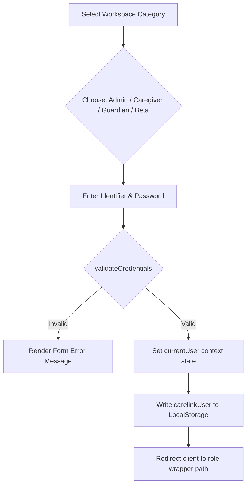

# Authentication and Authorization Specification

**Project:** CareLink Guardian Portal  
**Subtitle:** Healthcare Operations & Family Care Management Platform  
**Version:** 1.0  
**Prepared By:** Lakshara Anand V V  
**Register Number:** RA2411003050128  
**Project Supervisor:** Dr. Rahmath Nisha  
**Academic Year:** 2026–2027  

---

# Document Metadata

| Field | Value |
| :--- | :--- |
| **Document Version** | 1.0 |
| **Last Updated** | 2026-07-04 |
| **Prepared By** | Lakshara Anand V V |
| **Reviewed By** | Dr. Rahmath Nisha |
| **Project** | CareLink Guardian Portal |
| **Document Type** | Authentication & Authorization Specification |

---

# Table of Contents
- [1. Introduction](#1-introduction)
- [2. Objectives](#2-objectives)
- [3. Scope](#3-scope)
- [4. Main Content](#4-main-content)
  - [4.1 Authentication Architecture](#41-authentication-architecture)
  - [4.2 Login Workflow \& Workspace Selection](#42-login-workflow--workspace-selection)
  - [4.3 Session Persistence \& Hydration Lifecycle](#43-session-persistence--hydration-lifecycle)
  - [4.4 Route Guard Interceptor (`ProtectedRoute`)](#44-route-guard-interceptor-protectedroute)
  - [4.5 Role-Based Access Scopes (Data Visibility)](#45-role-based-access-scopes-data-visibility)
- [5. Summary](#5-summary)
- [6. Conclusion](#6-conclusion)
- [Author](#author)
- [Project Supervisor](#project-supervisor)

---

# 1. Introduction

## 1.1 Purpose
This document specifies the Authentication and Authorization flows for the CareLink Guardian Portal application. It outlines the role-based access control (RBAC) schemas, credential validation mechanisms, session hydration paths, and route guard boundaries.

## 1.2 Scope
The scope of this specification covers username/password validations, local session caching, component route guards (`ProtectedRoute`), and role-scoped data queries.

## 1.3 Intended Audience
This specification is prepared for backend engineering partners, security inspectors, academic reviewers, and test engineers.

## 1.4 Relationship to the Overall Project
The Authentication and Authorization specifications outline the security barriers that govern route accessibility and data visibility scopes described in the HLD, LLD, and Routing documents.

---

# 2. Objectives

The primary engineering objectives of this security specification are:
- Define credential checking structures inside the browser thread.
- Standardize session persistence using LocalStorage tokens.
- Implement component-level layout guards to intercept unauthorized routing.
- Establish filter rules to restrict data records visibility according to active roles.

---

# 3. Scope

This security specification is bounded by the client-side execution sandbox:
- **Included:** Client route guards, session storage keys, local login forms, and context filter scopes.
- **Excluded:** Active server-side token signings, secure cookie handling, or remote database permission checks.

---

# 4. Main Content

## 4.1 Authentication Architecture
The application implements a secure role-based access control (RBAC) architecture that executes entirely in the client layer. Pre-seeded credentials are validated in the browser context against a configuration list, and session details are persisted across browser reloads.

## 4.2 Login Workflow & Workspace Selection
The login interface (`src/app/login/page.js`) separates accounts by workspace category.



1.  **Category Selection**: The user selects their target workspace:
    *   *Administrator:* Operations management.
    *   *Caregiver:* Assigned resident checklists.
    *   *Guardian:* Family health views.
    *   *Beta:* Test workspace.
2.  **Credential Validation**: Submitting the form calls `validateCredentials()` in `auth.js`, which checks the username/email and password against the pre-seeded account configurations.
3.  **Redirection**: On successful validation, the system saves the session and redirects the user:
    *   Admins -> `/admin`
    *   Caregivers -> `/caregiver`
    *   Guardians -> `/guardian`

## 4.3 Session Persistence & Hydration Lifecycle
*   **Persistence**: Successful logins save the normalized user session to LocalStorage under the `carelinkUser` key.
*   **Hydration**: At boot, the `DashboardProvider` context runs an effect microtask:
    1.  Checks for a `carelinkUser` entry in LocalStorage.
    2.  If found, parses the JSON string, normalizes the fields, and populates the `currentUser` state.
    3.  Set `isHydrated` to `true`, resolving the layout shell's loading skeleton.
*   **Session Destruction**: Logging out clears the session by setting `currentUser` to `null` and deleting the `carelinkUser` key from LocalStorage.

## 4.4 Route Guard Interceptor (`ProtectedRoute`)
The routing layer blocks access to internal dashboards using the `ProtectedRoute` component wrapper.

```javascript
export default function ProtectedRoute({ children, requiredRole }) {
  const { currentUser, isHydrated } = useDashboard();
  const router = useRouter();

  useEffect(() => {
    if (isHydrated && !currentUser) {
      router.replace("/login");
    }
  }, [currentUser, isHydrated, router]);

  if (!isHydrated) return <SkeletonLoader />;
  if (!currentUser) return null;

  if (requiredRole && requiredRole !== "any" && currentUser.role !== requiredRole) {
    return (
      <main className="min-h-screen bg-[var(--surface-base)] flex items-center justify-center p-6">
        <Card className="max-w-md p-8 text-center shadow-[var(--shadow-lg)]">
          <h1 className="text-2xl font-black text-[var(--color-danger-500)]">Access Denied</h1>
          <p className="mt-3 text-sm text-[var(--color-gray-600)]">Your account role does not have authorization to view this workspace.</p>
        </Card>
      </main>
    );
  }

  return children;
}
```

## 4.5 Role-Based Access Scopes (Data Visibility)
Data visibility is enforced at the context level. Even if a user accesses a route, filter functions limit the data returned:

*   **Admin Scope**: Has read and write access to all active residents, caregivers, and system settings.
*   **Caregiver Scope**: Can only view residents listed in their `assignedResidentIds` array. They have read-only access to caregiver profiles and write access to clinical checklists and vitals forms.
*   **Guardian Scope**: Can only view residents linked to their `guardianId`. They have read-only access to vitals trend charts and caregiver timelines.
*   **Beta Scope**: Placed in an isolated empty environment (`FACILITY_BETA`), where all metrics and records start as clean, empty slates for validation testing.

---

# 5. Summary

This Authentication and Authorization Specification outlines the client-side security architecture of the CareLink Guardian Portal. It details the login credentials flow, maps session caching lifecycles, and specifies the route protection code and role visibility query filters.

---

# 6. Conclusion

Implementing route guards and component access boundaries enforces security scopes in the client thread. Hydrating user state from LocalStorage maintains session persistence while protecting internal views.

---

## Author

**Lakshara Anand V V**  
Bachelor of Technology  
Computer Science and Engineering  
SRM Institute of Science and Technology  
Tiruchirappalli Campus  
Academic Year: 2026–2027  

---

## Project Supervisor

**Dr. Rahmath Nisha**  
Assistant Professor  
Department of Computer Science and Engineering  
SRM Institute of Science and Technology  
Tiruchirappalli Campus  

---

CareLink Guardian Portal  
Healthcare Operations & Family Care Management Platform  
© 2026 Lakshara Anand V V  
SRM Institute of Science and Technology  
Tiruchirappalli Campus  
