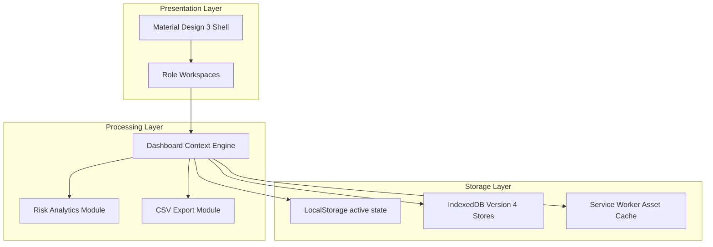

# Final Project Report

**Project:** CareLink Guardian Portal  
**Subtitle:** Healthcare Operations & Family Care Management Platform  
**Version:** 1.0  
**Prepared By:** Lakshara Anand V V  
**Register Number:** RA2411003050128  
**Project Supervisor:** Dr. Rahmath Nisha  
**Academic Year:** 2026–2027  

---

# Document Metadata

| Field | Value |
| :--- | :--- |
| **Document Version** | 1.0 |
| **Last Updated** | 2026-07-04 |
| **Prepared By** | Lakshara Anand V V |
| **Reviewed By** | Dr. Rahmath Nisha |
| **Project** | CareLink Guardian Portal |
| **Document Type** | Final Project Report / Capstone Thesis |

---

# Table of Contents
- [1. Introduction](#1-introduction)
- [2. Objectives](#2-objectives)
- [3. Scope](#3-scope)
- [4. Main Content](#4-main-content)
  - [4.1 Abstract](#41-abstract)
  - [4.2 Revision History & Technology Versions](#42-revision-history--technology-versions)
  - [4.3 Chapter 1: Introduction](#43-chapter-1-introduction)
  - [4.4 Chapter 2: Problem Statement](#44-chapter-2-problem-statement)
  - [4.5 Chapter 3: Objectives](#45-chapter-3-objectives)
  - [4.6 Chapter 4: Existing System vs. Proposed System](#46-chapter-4-existing-system-vs-proposed-system)
  - [4.7 Chapter 5: Technologies Used](#47-chapter-5-technologies-used)
  - [4.8 Chapter 6: System Architecture](#48-chapter-6-system-architecture)
  - [4.9 Chapter 7: Module Description](#49-chapter-7-module-description)
  - [4.10 Chapter 8: Implementation Details](#410-chapter-8-implementation-details)
  - [4.11 Chapter 9: Testing and Verification](#411-chapter-9-testing-and-verification)
  - [4.12 Chapter 10: Project Validation and Community Impact](#412-chapter-10-project-validation-and-community-impact)
  - [4.13 Chapter 11: Limitations](#413-chapter-11-limitations)
  - [4.14 Chapter 12: Conclusion and Future Scope](#414-chapter-12-conclusion-and-future-scope)
  - [4.15 References](#415-references)
- [5. Summary](#5-summary)
- [6. Conclusion](#6-conclusion)
- [Author](#author)
- [Project Supervisor](#project-supervisor)

---

# 1. Introduction

## 1.1 Purpose
This document constitutes the Final Project Report (Capstone Thesis) for the CareLink Guardian Portal project. It documents the requirement parameters, high-level architectures, low-level routines, testing configurations, and deployment strategies of the frontend system.

## 1.2 Scope
The scope of this report covers the end-to-end development of the Next.js 15 PWA, including the client-side state engine, role-based workspaces, local caching models, simulated API clients, and the community field validation.

## 1.3 Intended Audience
This thesis is prepared for the academic evaluation panel, CSE department supervisors, and software engineering reviewers at SRM Institute of Science and Technology.

## 1.4 Relationship to the Overall Project
This document represents the comprehensive compilation of the project's design and implementation results, serving as the primary academic review artifact.

---

# 2. Objectives

The primary objectives of this project are:
- Build a standalone PWA designed for residential healthcare environments.
- Enable caregivers to record vitals and mark checklists while offline using browser storage databases.
- Develop interactive, browser-rendered charts to visualize vital histories for resident families.
- Validate the software's functional workflow under a social utility framework in a local community care organization.

---

# 3. Scope

This project report outlines the software design, system modules, and code implementations:
- **Scope Limits:** Focuses on the client-side user interface and local transactional database caching using React, Tailwind v4, and IndexedDB.
- **Academic Context:** Includes details of the field trial completed under the Community Connect Programme with Renaissance Trust in Ammapet, Salem.

---

# 4. Main Content

## 4.1 Abstract
The CareLink Guardian Portal is a standalone frontend Progressive Web Application (PWA) built using Next.js 15, React 19, and Tailwind CSS v4 to coordinate senior care. The application integrates caregivers, administrators, and family guardians into a unified, role-isolated web interface. 

To address typical connectivity issues in healthcare facilities, the portal implements local persistence. Vitals tracking, daily care checklists, and status updates are managed using a centralized client-side React Context state engine, cached locally via LocalStorage, and prepared for synchronization via an IndexedDB version 4 database schema. This report documents the requirements, design, implementation, and verification of the system.

## 4.2 Revision History & Technology Versions

### Revision History
| Version | Date | Author | Description |
| :--- | :--- | :--- | :--- |
| v1.0.0 | June 29, 2026 | Kuralara WebFlux Design Team | Initial requirements gathering and architectural design. |
| v1.1.0 | July 01, 2026 | Kuralara WebFlux Design Team | Implementation of routing guards, context state provider, and charts module. |
| v1.2.0 | July 03, 2026 | Kuralara WebFlux Design Team | Final quality assurance audit and documentation refinement pass. |

### Technology Versions
| Framework / Library | Target Version | Purpose |
| :--- | :--- | :--- |
| **Next.js** | v15.x | Application Router framework and layout structure |
| **React** | v19.x | Client component trees, state hooks, and Context API |
| **Tailwind CSS** | v4.x | Styling framework utilizing compile-time design tokens |
| **Framer Motion** | v11.x | Client-side page transitions and custom overlays |
| **Chart.js** | v4.x | Dynamic health metrics graphing engine |
| **idb** | v8.x | Transactional IndexedDB schema wrapper |
| **React Icons** | v5.x | Lucide vector iconography system |

## 4.3 Chapter 1: Introduction
In senior living and residential care facilities, coordinating communication between administrators, caregivers, and family guardians is essential for resident wellness. CareLink Guardian Portal provides a modern web interface that surfaces wellness indexes, medical records, and caregivers' clinical tasks. By managing state in the browser and implementing offline caching, the application delivers desktop-like speed, visual responsiveness, and offline resilience.

## 4.4 Chapter 2: Problem Statement
Traditional senior care coordination systems often suffer from:
1.  **Manual Transcription Latency**: Updates recorded on paper logs or legacy desktop applications delay access to information.
2.  **Role Confusion**: Interfaces that mix administrative configurations with clinical entry tools increase learning curves and run security risks.
3.  **Connectivity Disruption**: Healthcare facilities often experience network dropouts, rendering online-only cloud databases inaccessible.
4.  **Poor Family Visibility**: Guardians are often left out of day-to-day wellness logs, leading to coordination gaps.

## 4.5 Chapter 3: Objectives
The primary objectives of the CareLink Guardian Portal project are:
- Develop a standalone, role-isolated dashboard interface.
- Implement an offline PWA architecture using service workers and browser caches.
- Implement a Material Design 3 inspired UI with theme values, clean cards, and micro-animations.
- Integrate interactive graphs using Chart.js to visualize resident health trends.
- Enable direct data extraction via client-side CSV export utilities.

## 4.6 Chapter 4: Existing System vs. Proposed System

### 4.1 Existing System
The existing system relies on paper logs or centralized desktop database terminals:
*   **Drawbacks:**
    *   High transcription error rates.
    *   Lack of real-time visibility for family members.
    *   Complete operational downtime during internet outbox disruptions.
    *   Vulnerability to access control bypasses.

### 4.2 Proposed System
The proposed system is a standalone PWA dashboard running in the browser sandbox:
*   **Advantages:**
    *   Fast, client-side views powered by Next.js 15.
    *   Strict client-side role isolation using route guards.
    *   Offline logging using a local synchronization queue.
    *   Empirical data access with CSV downloads.

## 4.7 Chapter 5: Technologies Used
*   **Next.js 15 (App Router)**: Component layout routing.
*   **React**: Component state lifecycle hooks.
*   **Tailwind CSS v4**: Fluid layout styles mapped to design variables.
*   **Framer Motion**: Smooth page transitions.
*   **Chart.js**: Client-side canvas charting.
*   **IndexedDB (`idb` wrapper)**: Structured offline data caching.
*   **LocalStorage**: Session and active state caching.
*   **Service Worker (`sw.js`)**: Static asset cache delivery.

## 4.8 Chapter 6: System Architecture



The frontend architecture separates the interface layout from state processing and local storage caching:
1.  **Presentation Layer**: Renders responsive layout shells, navigation sidebars, forms, and charts.
2.  **Processing Layer**: Manages client-side states, computes clinical risk levels, and processes sync queues.
3.  **Storage Layer**: Persists active state configurations in LocalStorage and defines IndexedDB stores for offline databases.

## 4.9 Chapter 7: Module Description

### 7.1 Administrator Module
Provides administrative control over the facility's residents and caregivers:
- Admit new residents and assign caregivers and guardians.
- Edit clinical details and medical histories.
- Archive or soft-delete resident profiles.
- Review caregiver shift logs and global audit records.

### 7.2 Caregiver Module
Provides a mobile-optimized view for daily care tasks:
- Access resident task checklists (Medication, Nutrition, Hygiene, Mobility).
- Record vital readings and verify values against clinical thresholds.
- Log daily observations and write shift handover summaries.

### 7.3 Guardian Module
A read-only wellness portal for family members:
- View overall resident wellness ratings.
- Review historical vitals trends using interactive Chart.js graphs.
- Track daily caregiver logs on a chronological timeline.

### 7.4 Sync Control Module
Manages offline operations and queue status updates:
- Set simulated network state (online vs. offline).
- Simulate API server failures (HTTP 500) for testing.
- Review pending sync events and trigger queue sweeps.

## 4.10 Chapter 8: Implementation Details

### 8.1 State Provider Setup (`DashboardContext.jsx`)
Exposes the global state and mutator methods to child routes:
```javascript
export function DashboardProvider({ children }) {
  const [data, setData] = useState(initialState);
  const [currentUser, setCurrentUser] = useState(null);

  // Sync state to local storage on changes
  useEffect(() => {
    if (!isHydrated) return;
    localStorage.setItem("carelink_sprint_4_17_state", JSON.stringify(data));
  }, [data, isHydrated]);

  // Exposes callbacks...
}
```

### 8.2 Client-Side Route Protection (`ProtectedRoute.jsx`)
Intercepts route changes to restrict access:
```javascript
if (requiredRole && currentUser.role !== requiredRole) {
  return <AccessDeniedScreen />;
}
```

## 4.11 Chapter 9: Testing and Verification
Testing verified system capabilities under clean-slate environments and network dropouts:
-   **Route Interception**: Entering `/admin` as a guardian returns an access denied view.
-   **Offline Data Entry**: Updates logged in offline mode remain cached in the local synchronization queue (`careLinkSyncEvents` store) until connectivity is restored and synchronization is triggered.
-   **Responsive Layout**: Fluid layouts scale seamlessly from mobile widths (collapsing the sidebar into a drawer menu) to widescreen displays.

## 4.12 Chapter 10: Project Validation and Community Impact
The CareLink Guardian Portal was successfully field-tested and validated under the Community Connect Programme. This academic project was deployed in collaboration with **Renaissance Trust, Ammapet, Salem** to evaluate its practical utility in real-world caregiver coordination.

### 10.1 Key Program Details
*   **Program Name:** Community Connect Programme
*   **Partnering Authority:** Renaissance Trust, Ammapet, Salem
*   **Validation Process:** Care volunteers used the caregiver mobile checklists to log resident vitals under network failure simulations, and guardians evaluated health visualization panels.
*   **Resulting Validation:** The field trials validated the usability, accessibility, and offline resilience of the platform's features, resulting in the issuance of an official completion certificate by the organization.
*   **Certificate Path:** [docs/certificates/community_connect_certificate.png](certificates/community_connect_certificate.png) (Refer to [docs/certificates/README.md](certificates/README.md) for metadata)

The completion certificate serves as empirical evidence of the project's practical implementation and successful community engagement.

## 4.13 Chapter 11: Limitations
The current standalone client-side implementation of the CareLink Guardian Portal has the following structural limitations:
-   **Local Browser Storage**: Data persistence depends on browser settings. Clearing browser site data resets active records and synchronization history.
-   **Mock Authentication**: User authentication checks and role validations are verified locally in the client layer against configuration structures.
-   **Simulated Notifications**: Activity notifications and warnings are generated in the client state engine context rather than being pushed by an external message broker.
-   **No Live Backend**: The integration client uses simulated delays and local failure simulation switches rather than real-time cloud connections.
-   **Demo Healthcare Dataset**: The patient registries and logs use static mock datasets for demonstration purposes.

## 4.14 Chapter 12: Conclusion and Future Scope

### 12.1 Conclusion
The CareLink Guardian Portal demonstrates how an offline frontend architecture can improve senior care coordination. Using modern web technologies like Next.js 15, Tailwind v4, and browser storage interfaces, the portal provides a fast, responsive, and secure dashboard experience.

### 12.2 Future Scope (Frontend)

#### Near-Term Enhancements
-   **Integrated Theme System**: Expand the Tailwind CSS v4 variables configuration to include a high-contrast dark mode to improve accessibility.
-   **Multilingual Support (i18n)**: Integrate translation libraries (e.g., `next-intl`) to facilitate localization for diverse staff and family profiles.
-   **Biometric Authentication (WebAuthn)**: Support passwordless, biometric login mechanisms using the browser's native WebAuthn API to improve caregiver logging speed.

#### Long-Term Enhancements
-   **AI-Powered Wellness Insights**: Integrate client-side analytical models (such as TensorFlow.js) to detect anomalous vitals patterns and generate explainable health alerts.
-   **Wearable Device Integration**: Utilize the Web Bluetooth API to connect directly to heart rate, oxygen level, and temperature sensors.
-   **Service Worker Push Notifications**: Register background push notifications using the Push API to alert staff and family members immediately.

## 4.15 References
1.  **Next.js 15 App Router**: Next.js 15 App Router Developer Guides and Routing Reference, Vercel Inc. Available online at: [https://nextjs.org/docs](https://nextjs.org/docs) (Accessed July 2026).
2.  **React 19 Framework**: React 19 Client-Side Hooks and Context API Reference, Meta Open Source. Available online at: [https://react.dev/reference](https://react.dev/reference) (Accessed July 2026).
3.  **Tailwind CSS v4**: Tailwind CSS Utility Styling and Build Tool Configuration, Tailwind Labs Inc. Available online at: [https://tailwindcss.com/docs](https://tailwindcss.com/docs) (Accessed July 2026).
4.  **Material Design 3**: Material Design 3 UI Principles, Elevation Systems, and Typography Guidelines, Google LLC. Available online at: [https://m3.material.io](https://m3.material.io) (Accessed July 2026).
5.  **Chart.js**: Chart.js Dynamic HTML5 Canvas Charting Engine Reference, Chart.js Contributors. Available online at: [https://www.chartjs.org/docs](https://www.chartjs.org/docs) (Accessed July 2026).
6.  **IndexedDB API**: MDN Web Docs: Structured Client-Side Data Storage and Transactions, Mozilla Developer Network. Available online at: [https://developer.mozilla.org/en-US/docs/Web/API/IndexedDB_API](https://developer.mozilla.org/en-US/docs/Web/API/IndexedDB_API) (Accessed July 2026).
7.  **Service Workers & PWAs**: MDN Web Docs: Progressive Web Applications and Offline Service Worker API, Mozilla Developer Network. Available online at: [https://developer.mozilla.org/en-US/docs/Web/API/Service_Worker_API](https://developer.mozilla.org/en-US/docs/Web/API/Service_Worker_API) (Accessed July 2026).
8.  **HTML Living Standard**: WHATWG (Web Hypertext Application Technology Working Group). HTML Living Standard. Available online at: [https://html.spec.whatwg.org](https://html.spec.whatwg.org) (Accessed July 2026).
9.  **ECMAScript Specification**: ECMA International. ECMAScript® 2026 Language Specification. Available online at: [https://tc39.es/ecma262](https://tc39.es/ecma262) (Accessed July 2026).
10. **Web Content Accessibility Guidelines (WCAG) 2.2**: W3C (World Wide Web Consortium). Web Content Accessibility Guidelines (WCAG) 2.2. Available online at: [https://www.w3.org/TR/WCAG22](https://www.w3.org/TR/WCAG22) (Accessed July 2026).
11. **IEEE Software Engineering Standards**: IEEE Std 829-2008, IEEE Standard for Software and System Test Documentation, IEEE Computer Society. Available at: [https://ieeexplore.ieee.org](https://ieeexplore.ieee.org).
12. **ISO/IEC 25010 Quality Models**: ISO/IEC 25010:2011, Systems and software engineering — Systems and software Quality Requirements and Evaluation (SQuaRE) — System and software quality models. Available at: [https://www.iso.org](https://www.iso.org).
13. **Nielsen Norman Group UX Guidelines**: Nielsen, J. Ten Usability Heuristics for User Interface Design, Nielsen Norman Group. Available online at: [https://www.nngroup.com/articles/ten-usability-heuristics](https://www.nngroup.com/articles/ten-usability-heuristics).
14. **Google Web Fundamentals (PWA)**: Google Developers. Progressive Web Apps and Service Worker Core Guides. Available online at: [https://web.dev/explore/progressive-web-apps](https://web.dev/explore/progressive-web-apps).

---

# 5. Summary

This document compiles the capstone report for the CareLink Guardian Portal. It details the problem analysis, software objectives, technological layouts, architectural modules, validation strategies under the Community Connect Programme, and future development steps.

---

# 6. Conclusion

The CareLink Guardian Portal implements a standalone frontend designed for clinical activities. Standardized development utilizing React 19 and Next.js 15 combined with field trials validated by Renaissance Trust confirms the usability and implementation viability of this application.

---

## Author

**Lakshara Anand V V**  
Bachelor of Technology  
Computer Science and Engineering  
SRM Institute of Science and Technology  
Tiruchirappalli Campus  
Academic Year: 2026–2027  

---

## Project Supervisor

**Dr. Rahmath Nisha**  
Assistant Professor  
Department of Computer Science and Engineering  
SRM Institute of Science and Technology  
Tiruchirappalli Campus  

---

CareLink Guardian Portal  
Healthcare Operations & Family Care Management Platform  
© 2026 Lakshara Anand V V  
SRM Institute of Science and Technology  
Tiruchirappalli Campus  
