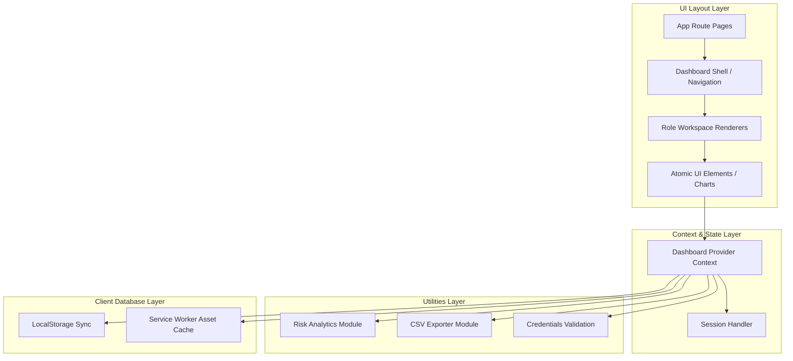

# Frontend Architecture

**Project:** CareLink Guardian Portal  
**Subtitle:** Healthcare Operations & Family Care Management Platform  
**Version:** 1.0  
**Prepared By:** Lakshara Anand V V  
**Register Number:** RA2411003050128  
**Project Supervisor:** Dr. Rahmath Nisha  
**Academic Year:** 2026–2027  

---

# Document Metadata

| Field | Value |
| :--- | :--- |
| **Document Version** | 1.0 |
| **Last Updated** | 2026-07-04 |
| **Prepared By** | Lakshara Anand V V |
| **Reviewed By** | Dr. Rahmath Nisha |
| **Project** | CareLink Guardian Portal |
| **Document Type** | Frontend Architecture Document |

---

# Table of Contents
- [1. Introduction](#1-introduction)
- [2. Objectives](#2-objectives)
- [3. Scope](#3-scope)
- [4. Main Content](#4-main-content)
  - [4.1 Application Layers](#41-application-layers)
  - [4.2 Component Hierarchy](#42-component-hierarchy)
  - [4.3 Next.js App Router Structure](#43-next-js-app-router-structure)
  - [4.4 Authentication Guard Architecture](#44-authentication-guard-architecture)
  - [4.5 Reusable Component Strategy](#45-reusable-component-strategy)
- [5. Summary](#5-summary)
- [6. Conclusion](#6-conclusion)
- [Author](#author)
- [Project Supervisor](#project-supervisor)

---

# 1. Introduction

## 1.1 Purpose
This document outlines the Frontend Architecture for the CareLink Guardian Portal application. It describes the application layers, component runtime trees, App Router folders, authentication boundaries, and the reusable components layout.

## 1.2 Scope
The scope of this document covers the Next.js 15 routing folder structure, route guard components, state provider wrappers, UI folders, and static asset deployment configurations.

## 1.3 Intended Audience
This document is prepared for frontend developers, project architects, academic reviewers, and system quality evaluators.

## 1.4 Relationship to the Overall Project
The Frontend Architecture translates the high-level system layout (HLD) into concrete React/Next.js folders and import schemes, establishing file relationships within the codebase.

---

# 2. Objectives

The primary engineering objectives of this Frontend Architecture specification are:
- Establish a four-tier architecture separating pages, states, utilities, and storage caches.
- Map the runtime react component trees from layout roots to specific workspace panels.
- Define file-based routing endpoints for all administrator, caregiver, and guardian paths.
- Detail the decoupled UI component layout separating state-aware blocks from atomic elements.

---

# 3. Scope

This architectural specification is bounded by the development workspace structure:
- **Included:** Folder naming conventions, component trees, authentication guard mechanics, and component library separation rules.
- **Excluded:** Back-end service architectures (e.g. database servers and web server routing rules).

---

# 4. Main Content

## 4.1 Application Layers
The application operates as a standalone, layer-isolated Next.js 15 App Router architecture. It is split into four distinct layers:



1.  **Routing & Presentation Layer**: App Router routes handle initial requests, wrapping pages in `ProtectedRoute` and `DashboardShell` components.
2.  **Context & State Layer**: The `DashboardContext` acts as the single source of truth. It manages state variables, exposes callback functions, and processes local microtask queues.
3.  **Business & Utilities Layer**: Houses client-side calculations, CSV parsing logic, and validation procedures.
4.  **Client Database Cache**: Synchronizes local state changes to LocalStorage and caches static shell assets.

## 4.2 Component Hierarchy
A structured representation of the runtime component hierarchy inside the portal:

```text
[layout.js] (Root Layout)
  └── [ServiceWorkerRegistration] (PWA Initializer)
  └── [DashboardProvider] (Shared State Context)
        └── [page.js] (Portal Landing Page)
        └── [login/page.js] (Login Form)
        └── [ProtectedRoute] (Role Authorization Guard)
              └── [DashboardShell] (Sidebar & Layout Structure)
                    └── [Sidebar] (Role-Specific Navigation List)
                    └── [PageTransition] (Framer Motion Animation Wrapper)
                          └── [AdminWorkspace] (Admins Control Grid)
                          └── [CaregiverWorkspace] (Daily Task Boards & Checklist Forms)
                          └── [GuardianWorkspace] (Family Wellness Metrics & Chart.js Tab Views)
                          └── [BetaWorkspace] (System Testing Clean Surface)
```

## 4.3 Next.js App Router Structure
The route organization leverages App Router directories, mapping folders directly to URL endpoints.

*   `src/app/layout.js`: The root wrapper that initializes CSS styles, fonts, the service worker, and binds the global `DashboardProvider`.
*   `src/app/page.js`: The primary landing page detailing portal features, role summaries, and access routes.
*   `src/app/login/page.js`: The workspace selector and login form.
*   `src/app/admin/page.js`, `src/app/caregiver/page.js`, `src/app/guardian/page.js`: Wrapper pages that enforce role-based access before rendering the corresponding workspace views.
*   `src/app/residents/page.js`, `src/app/caregiver-registry/page.js`, `src/app/reports/page.js`, `src/app/settings/page.js`, `src/app/notifications/page.js`, `src/app/analytics/page.js`: Secondary pages that display features scoped to the authenticated user's role.

## 4.4 Authentication Guard Architecture
The application enforces security at the page-hierarchy boundary using the client-side `ProtectedRoute` wrapper.

*   **Operation**:
    *   The page component wraps its content inside `<ProtectedRoute requiredRole="[role]">`.
    *   At mount, the component reads `currentUser` and `isHydrated` from `DashboardContext`.
    *   If the user is unauthenticated, it redirects them to `/login` using the `useRouter()` hook.
    *   If authenticated but missing the matching role, it renders a custom denial notice ("Access Denied").
    *   If values match, it renders the child dashboard component.

## 4.5 Reusable Component Strategy
The directory structure separates layout blocks from reusable components:

*   **Atomic UI Components** (`src/app/components/ui/`): Highly reusable, stateless visual components (e.g., `Button`, `Card`, `Badge`, `StatCard`, `SkeletonLoader`).
*   **Composite Modules** (`src/app/components/`): State-aware layouts that bind directly to `useDashboard` hooks (e.g., `Sidebar`, `AnalyticsChart`, `VitalsChartTabbed`, `CareUpdatePanel`).
*   **Separation of Concerns**: UI components handle styling and animations, while page layout blocks manage data filtering and role-based actions.

---

# 5. Summary

This Frontend Architecture specification outlines the Next.js routing and component design of the CareLink Guardian Portal. It details the presentation, business, and caching layers, tracks runtime component trees, and defines route safeguards.

---

# 6. Conclusion

Structuring the CareLink Guardian Portal frontend into isolated routing pages, shared context state engines, and atomic UI folders guarantees optimal performance and clean routing. Following these patterns ensures the system remains scalable, maintainable, and securely scoped.

---

## Author

**Lakshara Anand V V**  
Bachelor of Technology  
Computer Science and Engineering  
SRM Institute of Science and Technology  
Tiruchirappalli Campus  
Academic Year: 2026–2027  

---

## Project Supervisor

**Dr. Rahmath Nisha**  
Assistant Professor  
Department of Computer Science and Engineering  
SRM Institute of Science and Technology  
Tiruchirappalli Campus  

---

CareLink Guardian Portal  
Healthcare Operations & Family Care Management Platform  
© 2026 Lakshara Anand V V  
SRM Institute of Science and Technology  
Tiruchirappalli Campus  
