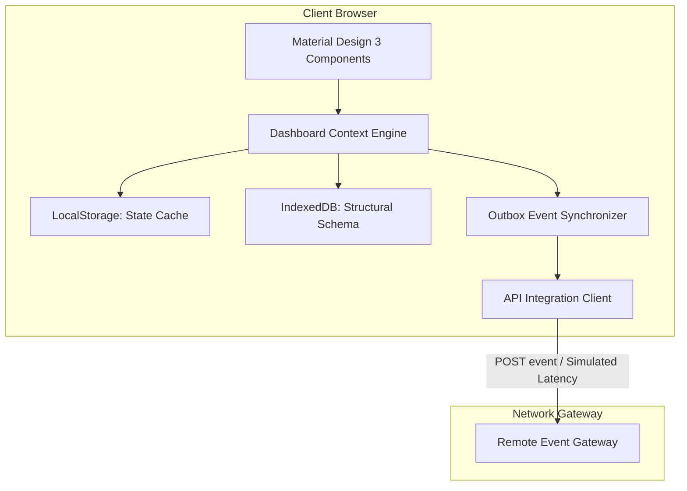
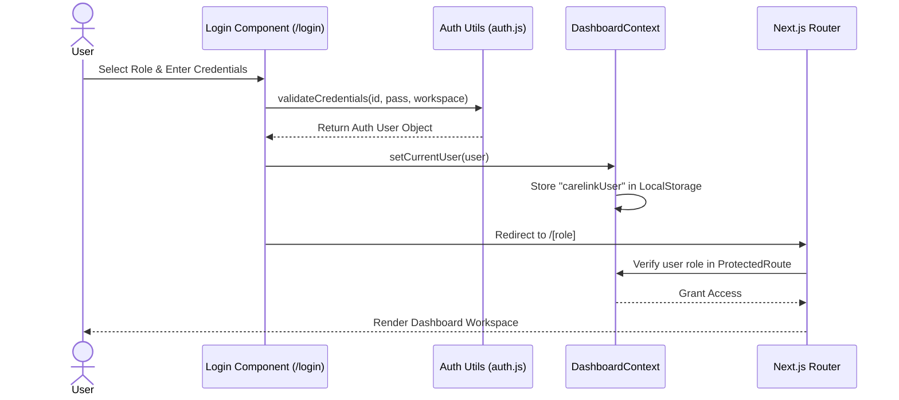
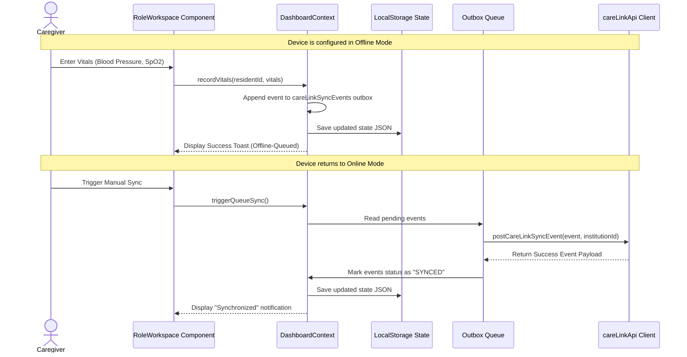

# High-Level Design (HLD)

**Project:** CareLink Guardian Portal  
**Subtitle:** Healthcare Operations & Family Care Management Platform  
**Version:** 1.0  
**Prepared By:** Lakshara Anand V V  
**Register Number:** RA2411003050128  
**Project Supervisor:** Dr. Rahmath Nisha  
**Academic Year:** 2026–2027  

---

# Document Metadata

| Field | Value |
| :--- | :--- |
| **Document Version** | 1.0 |
| **Last Updated** | 2026-07-04 |
| **Prepared By** | Lakshara Anand V V |
| **Reviewed By** | Dr. Rahmath Nisha |
| **Project** | CareLink Guardian Portal |
| **Document Type** | High-Level Design Document |

---

# Table of Contents
- [1. Introduction](#1-introduction)
- [2. Objectives](#2-objectives)
- [3. Scope](#3-scope)
- [4. Main Content](#4-main-content)
  - [4.1 System Overview](#41-system-overview)
  - [4.2 Architectural Subsystems](#42-architectural-subsystems)
  - [4.3 Core Sequence Diagrams](#43-core-sequence-diagrams)
  - [4.4 Interface Definitions](#44-interface-definitions)
- [5. Summary](#5-summary)
- [6. Conclusion](#6-conclusion)
- [Author](#author)
- [Project Supervisor](#project-supervisor)

---

# 1. Introduction

## 1.1 Purpose
This document provides the High-Level Design (HLD) for the CareLink Guardian Portal application. It defines the subsystem boundaries, structural relationships, sequence workflows, and architectural design patterns.

## 1.2 Scope
The scope of this HLD includes the Next.js frontend application structure, the client state context engine, visual charting integrations, local storage models, and the simulated API integration client.

## 1.3 Intended Audience
This document is intended for project architects, software developers, academic evaluators, and system reviewers analyzing the subsystem layout of the portal.

## 1.4 Relationship to the Overall Project
The HLD translates software requirements (SRS) into structured components and subsystems, providing a roadmap for the Low-Level Design (LLD) specifications.

---

# 2. Objectives

The primary engineering objectives of this High-Level Design are:
- Establish a decoupled client-side web application layout using Next.js 15.
- Define a structured state engine utilizing React's Context API.
- Detail the offline caching layout utilizing LocalStorage and IndexedDB.
- Map subsystem dependencies to support role-based user workspaces.

---

# 3. Scope

This design specification is bounded by the client-side system architecture:
- **Included:** Folder router layouts, component subsystem groups, sequence diagrams for authentication and outbox synchronization, and high-level interface schemas.
- **Excluded:** Physical cloud server topologies, actual database server designs, and communication protocols (which are simulated).

---

# 4. Main Content

## 4.1 System Overview
The CareLink Guardian Portal is built as a single page experience (SPA) shell using Next.js 15 (App Router). Rather than delegating logic to backend orchestrators, all data evaluation, metrics computation, security rules, and user views are executed entirely inside the browser's client thread.



## 4.2 Architectural Subsystems
The application architecture is structured into five core subsystems:

### 4.2.1 Routing & Guards Subsystem
*   **Path Router**: Next.js App Router folders (`src/app/`) define the routes for workspaces, login, analytics, settings, and registries.
*   **Route Guard**: The `ProtectedRoute` component intercepts access, verifying if a user's role (`admin`, `caregiver`, `guardian`) matches the page's criteria. Unauthenticated users are redirected to `/login`.

### 4.2.2 Shared Application State (Context) Subsystem
*   **DashboardContext**: The core engine (`DashboardProvider` in `DashboardContext.jsx`) containing:
    *   Application state variables (residents, caregivers, guardians, alerts, notifications).
    *   Mutator methods (`updateResidentStatus`, `recordVitals`, `addResident`, `archiveResident`, `deleteResident`).
    *   Active session handling (`currentUser`, `setCurrentUser`).

### 4.2.3 UI & Presentation Subsystem
*   **Material Design 3 Component Library**: Custom-styled widgets (`Card`, `Button`, `Badge`, `SkeletonLoader`, `StatCard`, `PageTransition`) built via Tailwind CSS v4.
*   **Visualization Component**: Custom interactive canvas templates rendering health history logs (`AnalyticsChart`, `ReportChart`, `VitalsChartTabbed`) powered by Chart.js.
*   **Workspaces Renderer**: `RoleWorkspace.jsx` processes roles and renders tailored panels depending on the active workspace.

### 4.2.4 Offline-First Synchronization Subsystem
*   **Service Worker (`sw.js`)**: Caches static assets to guarantee instant boot times even when completely disconnected.
*   **Outbox Sync Store**: Buffers state-modifying actions inside local arrays, persisting them inside LocalStorage.
*   **Synchronizer Dashboard**: Renders the offline/online network simulator, allowing simulated API failures and triggering background batch sync tasks.

### 4.2.5 Data Utilities Subsystem
*   **Risk Analytics Engine (`riskAnalytics.js`)**: Computes clinical markers (e.g., ADL indexes, medication compliance scores, vital threshold warnings, fall risk evaluations) inside the client.
*   **Data Exporter (`csvExport.js`)**: Converts local resident records and activity logs directly into downloadable CSV tables without network transmissions.

## 4.3 Core Sequence Diagrams

### 4.3.1 Authentication & Workspace Routing Flow
This diagram illustrates the sequence from credentials entry to role-based dashboard loading.



### 4.3.2 Offline Vital Logging & Synchronization Flow
This sequence shows the path of a caregiver updating vitals when disconnected, and later syncing.



## 4.4 Interface Definitions

### 4.4.1 Local State Payload Structure
The application state managed by the context layer conforms to the following properties:

```typescript
interface ApplicationState {
  residents: Resident[];
  caregivers: Caregiver[];
  guardians: Guardian[];
  notifications: Notification[];
  activityHistory: ActivityLog[];
  caregiverActivityHistory: CaregiverLog[];
  careLinkSyncEvents: SyncEvent[];
  alerts: Alert[];
  systemSettings: SystemSettings;
}
```

### 4.4.2 API Integration Signature
The client layer exports an event dispatcher that isolates connection mechanics:

```typescript
export async function postCareLinkSyncEvent(
  event: SyncEvent, 
  institutionId: string
): Promise<SyncApiResponse>;
```
This handles simulated network lag, connectivity checks, offline state exceptions, and credentials verification from the client browser.

---

# 5. Summary

This High-Level Design document outlines the architectural subsystems of the CareLink Guardian Portal. It covers path routing layouts, context state engines, component libraries, outbox synchronization pipelines, and high-level client interface signatures.

---

# 6. Conclusion

The subsystem design and sequential flows established in this HLD provide a clear framework for building the CareLink Guardian Portal. Implementing these structured divisions ensures maximum codebase maintainability, security scoping, and caching reliability.

---

## Author

**Lakshara Anand V V**  
Bachelor of Technology  
Computer Science and Engineering  
SRM Institute of Science and Technology  
Tiruchirappalli Campus  
Academic Year: 2026–2027  

---

## Project Supervisor

**Dr. Rahmath Nisha**  
Assistant Professor  
Department of Computer Science and Engineering  
SRM Institute of Science and Technology  
Tiruchirappalli Campus  

---

CareLink Guardian Portal  
Healthcare Operations & Family Care Management Platform  
© 2026 Lakshara Anand V V  
SRM Institute of Science and Technology  
Tiruchirappalli Campus  
