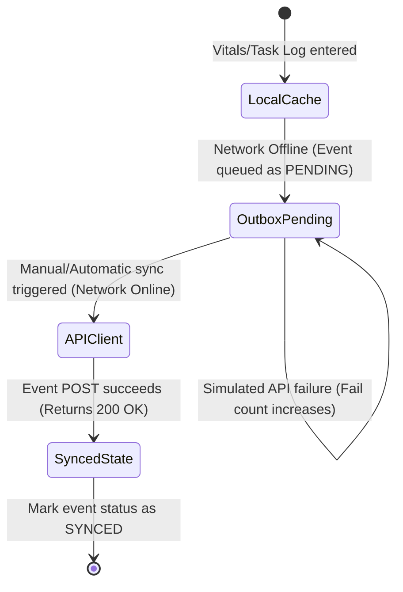

# Local Storage Design Document

**Project:** CareLink Guardian Portal  
**Subtitle:** Healthcare Operations & Family Care Management Platform  
**Version:** 1.0  
**Prepared By:** Lakshara Anand V V  
**Register Number:** RA2411003050128  
**Project Supervisor:** Dr. Rahmath Nisha  
**Academic Year:** 2026–2027  

---

# Document Metadata

| Field | Value |
| :--- | :--- |
| **Document Version** | 1.0 |
| **Last Updated** | 2026-07-04 |
| **Prepared By** | Lakshara Anand V V |
| **Reviewed By** | Dr. Rahmath Nisha |
| **Project** | CareLink Guardian Portal |
| **Document Type** | Local Storage Design Document |

---

# Table of Contents
- [1. Introduction](#1-introduction)
- [2. Objectives](#2-objectives)
- [3. Scope](#3-scope)
- [4. Main Content](#4-main-content)
  - [4.1 IndexedDB Database Design (`carelink-db`)](#41-indexeddb-database-design-carelink-db)
  - [4.2 Outbox Sync Event Store Schema](#42-outbox-sync-event-store-schema)
  - [4.3 Synchronization Lifecycle](#43-synchronization-lifecycle)
- [5. Summary](#5-summary)
- [6. Conclusion](#6-conclusion)
- [Author](#author)
- [Project Supervisor](#project-supervisor)

---

# 1. Introduction

## 1.1 Purpose
This document specifies the Local Storage Design for the CareLink Guardian Portal application. It outlines the schema configurations, store definitions, primary key paths, and transaction lifecycles for client browser storage databases.

## 1.2 Scope
The scope of this document covers the browser IndexedDB database (`carelink-db` version 4), LocalStorage active state caches, event outbox formats, and sync queue validation flows.

## 1.3 Intended Audience
This design document is prepared for database engineers, client developers, academic evaluators, and system reviewers checking offline storage resilience.

## 1.4 Relationship to the Overall Project
The Local Storage Design Document outlines the database structure that supports the state context provider (described in the State Management Specification) and provides local persistence for clinical workflows.

---

# 2. Objectives

The primary engineering objectives of this local storage design are:
- Detail the schemas, key paths, and indices of the seven IndexedDB object stores.
- Specify the type interfaces and parameters of the synchronization outbox event store.
- Map the state transition flow from capture to eventual synchronization.
- Define fallback behaviors for simulated network disruptions.

---

# 3. Scope

This design specification is bounded by the browser-sandbox storage limits:
- **Included:** Browser database versions, key paths, properties of the `SyncEvent` interface, and queue check logic.
- **Excluded:** Remote database schemas, cloud replication configurations, or backend server synchronization managers.

---

# 4. Main Content

## 4.1 IndexedDB Database Design (`carelink-db`)
The portal defines a structured, local client database using the browser's **IndexedDB** API (wrapped with the helper library `idb`). This offline-first data layer represents a production-grade schema for local caching, query execution, and synchronization.

### 4.1.1 Database Configuration
*   **Database Name**: `carelink-db`
*   **Database Version**: `4`

### 4.1.2 Object Stores Schema Reference
The database initializes seven specialized object stores, each configured with specific key paths:

| Store Name | Primary Key Path | Data Structure Description |
| :--- | :--- | :--- |
| `residents` | `id` | Demographic records, medical histories, care plans, and vital trends. |
| `notifications` | `id` | System and clinical notifications generated by care changes. |
| `activityHistory` | `id` | Global audit logs of admin and system actions. |
| `settings` | `key` | General settings key-value store (e.g., `currentUser`, `alerts`, `systemSettings`). |
| `caregivers` | `id` | Caregiver staff demographic metrics and duty boundaries. |
| `caregiverActivityHistory` | `id` | Staff action records for audit tracking. |
| `careLinkSyncEvents` | `eventId` | Outbox event records queued for API synchronization. (Underlying store name is `welfareSyncEvents` in the legacy code for compatibility). |

## 4.2 Outbox Sync Event Store Schema
The `careLinkSyncEvents` object store acts as a local outbox. When a caregiver updates vital signs or records a checklist item while offline, the system generates a synchronization event and caches it locally.

### 4.2.1 Event Object Schema
```typescript
interface SyncEvent {
  eventId: string;          // Unique UUID (e.g., "e-1719661200-a4f2")
  residentId: number;       // ID of the target resident
  eventType: string;        // Action type (e.g., "TASK_COMPLETED", "VITALS_RECORDED")
  payload: {
    field?: string;         // Name of the updated checklist field
    status?: string;        // Status value (e.g., "COMPLETED")
    vitals?: object;        // Vitals reading payload
    timestamp: string;      // Event timestamp
  };
  syncState: "PENDING" | "SYNCED"; // Synchronization state indicator
  timestamp: string;       // Date string of log entry
}
```

## 4.3 Synchronization Lifecycle
The synchronization queue follows a clear transition flow controlled by the client interface:



1.  **Event Capture**: User triggers a state change (e.g., records blood sugar).
2.  **Queuing**: If the application is set to **Offline Mode**, the action completes locally and an event record is appended to the `careLinkSyncEvents` outbox with status `"PENDING"`.
3.  **Trigger**: The user clicks **Trigger Sync** on the synchronizer dashboard.
4.  **Validation**: The queue runner loops through all `"PENDING"` records:
    *   Evaluates network status (rejects if set to offline).
    *   Verifies server simulations (rejects if simulated API failure is active).
5.  **Dispatch & Completion**: Events are dispatched sequentially. On success, their status is updated to `"SYNCED"`, and the outbox array commits back to the local database store.

---

# 5. Summary

This Local Storage Design Document specifies the client-side persistence models for the CareLink Guardian Portal. It details the IndexedDB object stores, defines the outbox event schema fields, and details the capture-to-commit synchronization lifecycle.

---

# 6. Conclusion

Implementing a transaction-safe IndexedDB database cache alongside LocalStorage ensures data remains intact during network drops. The local outbox architecture supports clinical data entry during network outages.

---

## Author

**Lakshara Anand V V**  
Bachelor of Technology  
Computer Science and Engineering  
SRM Institute of Science and Technology  
Tiruchirappalli Campus  
Academic Year: 2026–2027  

---

## Project Supervisor

**Dr. Rahmath Nisha**  
Assistant Professor  
Department of Computer Science and Engineering  
SRM Institute of Science and Technology  
Tiruchirappalli Campus  

---

CareLink Guardian Portal  
Healthcare Operations & Family Care Management Platform  
© 2026 Lakshara Anand V V  
SRM Institute of Science and Technology  
Tiruchirappalli Campus  
