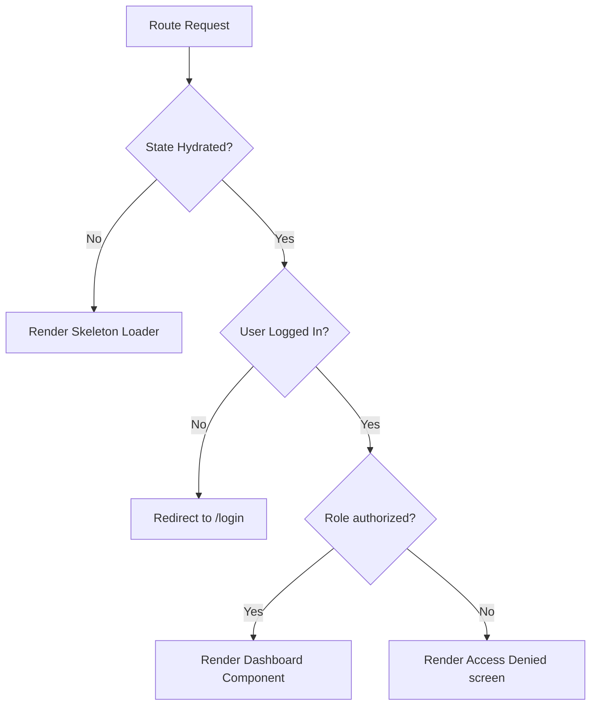

# Routing and Navigation Guard Documentation

**Project:** CareLink Guardian Portal  
**Subtitle:** Healthcare Operations & Family Care Management Platform  
**Version:** 1.0  
**Prepared By:** Lakshara Anand V V  
**Register Number:** RA2411003050128  
**Project Supervisor:** Dr. Rahmath Nisha  
**Academic Year:** 2026–2027  

---

# Document Metadata

| Field | Value |
| :--- | :--- |
| **Document Version** | 1.0 |
| **Last Updated** | 2026-07-04 |
| **Prepared By** | Lakshara Anand V V |
| **Reviewed By** | Dr. Rahmath Nisha |
| **Project** | CareLink Guardian Portal |
| **Document Type** | Routing & Access Control Specifications |

---

# Table of Contents
- [1. Introduction](#1-introduction)
- [2. Objectives](#2-objectives)
- [3. Scope](#3-scope)
- [4. Main Content](#4-main-content)
  - [4.1 Route Hierarchy](#41-route-hierarchy)
  - [4.2 Route Matrix \& Access Control](#42-route-matrix--access-control)
  - [4.3 Route Guard Mechanism (`ProtectedRoute.jsx`)](#43-route-guard-mechanism-protectedroutejsx)
  - [4.4 Navigation Flow Transitions](#44-navigation-flow-transitions)
- [5. Summary](#5-summary)
- [6. Conclusion](#6-conclusion)
- [Author](#author)
- [Project Supervisor](#project-supervisor)

---

# 1. Introduction

## 1.1 Purpose
This document specifies the routing structures, endpoint path configurations, access control matrices, and role authorization guards implemented inside the CareLink Guardian Portal.

## 1.2 Scope
The scope of this document covers Next.js URL paths, public/protected route variables, `ProtectedRoute` hydration hooks, and the login/logout redirection sequences.

## 1.3 Intended Audience
This technical guide is prepared for backend integrators, security reviewers, academic evaluators, and system developers.

## 1.4 Relationship to the Overall Project
The Routing Documentation translates access control scopes outlined in the SRS into specific page files and components, securing layouts at the component boundary.

---

# 2. Objectives

The primary engineering objectives of this routing specification are:
- Define the URL path hierarchy of the Next.js App Router directories.
- Detail the access clearance levels for all public and protected endpoints.
- Map the state validation lifecycle inside the route guard wrapper.
- Outline user session redirection triggers.

---

# 3. Scope

This specification is bounded by the client-side browser routing guards:
- **Included:** Route guard wrappers, redirect checks, route matrix scopes, and login/logout state wipes.
- **Excluded:** Domain name server configurations, load balancing, or middleware execution.

---

# 4. Main Content

## 4.1 Route Hierarchy
The application structure matches the Next.js App Router folders inside the `src/app/` directory:

```text
src/app/
├── page.js                     --> / (Public Landing Page)
├── login/
│   └── page.js                 --> /login (Public Login & Workspace Selector)
├── admin/
│   └── page.js                 --> /admin (Protected Admin Workspace Wrapper)
├── caregiver/
│   └── page.js                 --> /caregiver (Protected Caregiver Workspace Wrapper)
├── guardian/
│   └── page.js                 --> /guardian (Protected Guardian Workspace Wrapper)
├── analytics/
│   └── page.js                 --> /analytics (Protected Executive Analytics Page)
├── caregiver-registry/
│   └── page.js                 --> /caregiver-registry (Protected Staff Registry Page)
├── residents/
│   └── page.js                 --> /residents (Protected Resident Registry Page)
├── reports/
│   └── page.js                 --> /reports (Protected Compliance Report Page)
├── notifications/
│   └── page.js                 --> /notifications (Protected Alerts and Notifications Page)
└── settings/
    └── page.js                 --> /settings (Protected System Options Page)
```

## 4.2 Route Matrix & Access Control

| Route Path | Type | Allowed Roles | Guard Enforcement Component |
| :--- | :--- | :--- | :--- |
| `/` | Public | All (Anonymous & Authenticated) | *None* |
| `/login` | Public | All (Redirects if already logged in) | *Redirect logic inside LoginFormContent* |
| `/admin` | Protected | `admin` | `<ProtectedRoute requiredRole="admin">` |
| `/caregiver` | Protected | `caregiver` | `<ProtectedRoute requiredRole="caregiver">` |
| `/guardian` | Protected | `guardian` | `<ProtectedRoute requiredRole="guardian">` |
| `/analytics` | Protected | `admin` | `<ProtectedRoute requiredRole="admin">` |
| `/caregiver-registry` | Protected | `admin` | `<ProtectedRoute requiredRole="admin">` |
| `/residents` | Protected | `admin` | `<ProtectedRoute requiredRole="admin">` |
| `/reports` | Protected | `admin` | `<ProtectedRoute requiredRole="admin">` |
| `/notifications` | Protected | `admin`, `caregiver`, `guardian` | `<ProtectedRoute requiredRole="any">` |
| `/settings` | Protected | `admin`, `caregiver`, `guardian` | `<ProtectedRoute requiredRole="any">` |

## 4.3 Route Guard Mechanism (`ProtectedRoute.jsx`)
The routing gatekeeper is the custom `ProtectedRoute` component. It blocks client rendering of unauthorized pages.

### 4.3.1 Validation Lifecycle
1.  **Hydration Verification**: Before evaluating access, the guard waits for `isHydrated` to turn `true` in `DashboardContext`. During this period, it displays a `SkeletonLoader`.
2.  **Session Identification**: Once hydrated, it evaluates `currentUser`. If null, it redirects the browser to `/login`.
3.  **Role Access Check**:
    *   If a specific role is defined (e.g., `admin`), it verifies `currentUser.role === requiredRole`.
    *   If roles match, it renders children components.
    *   If roles mismatch, it renders an access denied banner ("Deny 403: Role Mismatch").



## 4.4 Navigation Flow Transitions

### 4.4.1 Login Lifecycle
*   Selecting a workspace (e.g., Guardian) limits credentials matching to that role group.
*   On successful validation, `setCurrentUser()` updates state, writes user JSON to `carelinkUser` in LocalStorage, and redirects the client to their dashboard route.

### 4.4.2 Logout Lifecycle
*   Clicking the Logout action clears local session variables:
    *   Destroys `currentUser` in React state.
    *   Deletes `carelinkUser` key from LocalStorage.
    *   Redirects the client browser to the home route (`/`).

---

# 5. Summary

This Routing and Navigation Guard Documentation details the page directory tree of the CareLink Guardian Portal. It contains the routing matrix configurations, describes the validation sequence inside the Route Guard, and outlines session lifecycles.

---

# 6. Conclusion

Securing dashboard modules at the client route guard boundary blocks unauthenticated or mismatched sessions. Executing this protection at the page layout boundary keeps data isolated and scoped.

---

## Author

**Lakshara Anand V V**  
Bachelor of Technology  
Computer Science and Engineering  
SRM Institute of Science and Technology  
Tiruchirappalli Campus  
Academic Year: 2026–2027  

---

## Project Supervisor

**Dr. Rahmath Nisha**  
Assistant Professor  
Department of Computer Science and Engineering  
SRM Institute of Science and Technology  
Tiruchirappalli Campus  

---

CareLink Guardian Portal  
Healthcare Operations & Family Care Management Platform  
© 2026 Lakshara Anand V V  
SRM Institute of Science and Technology  
Tiruchirappalli Campus  
