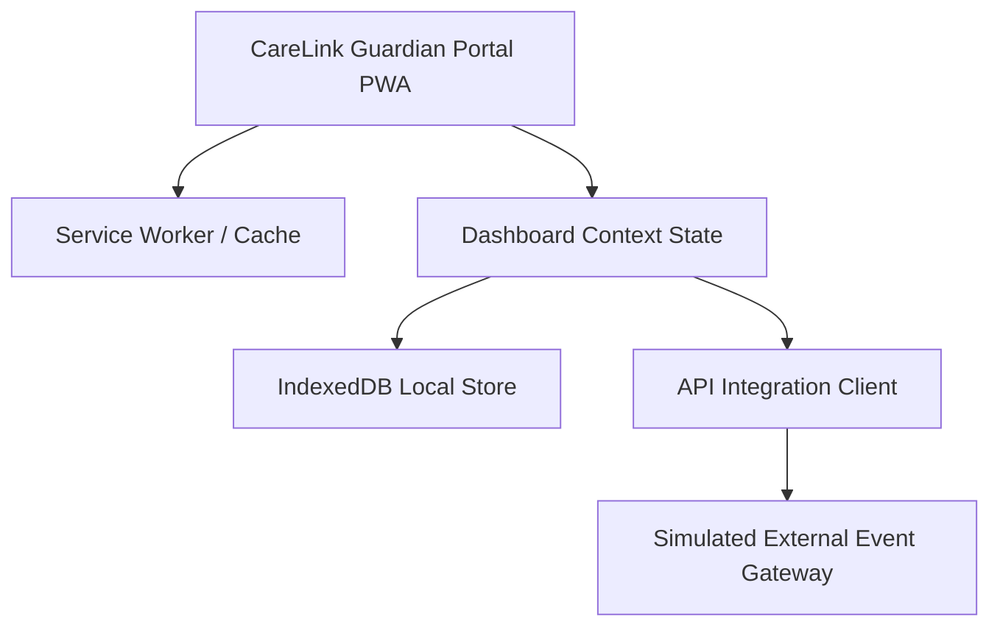

# Software Requirements Specification (SRS)

**Project:** CareLink Guardian Portal  
**Subtitle:** Healthcare Operations & Family Care Management Platform  
**Version:** 1.0  
**Prepared By:** Lakshara Anand V V  
**Register Number:** RA2411003050128  
**Project Supervisor:** Dr. Rahmath Nisha  
**Academic Year:** 2026–2027  

---

# Document Metadata

| Field | Value |
| :--- | :--- |
| **Document Version** | 1.0 |
| **Last Updated** | 2026-07-04 |
| **Prepared By** | Lakshara Anand V V |
| **Reviewed By** | Dr. Rahmath Nisha |
| **Project** | CareLink Guardian Portal |
| **Document Type** | Software Requirements Specification |

---

# Table of Contents
- [1. Introduction](#1-introduction)
  - [1.1 Purpose](#11-purpose)
  - [1.2 Scope](#12-scope)
  - [1.3 Objectives](#13-objectives)
  - [1.4 Intended Audience](#14-intended-audience)
  - [1.5 Relationship to the Overall Project](#15-relationship-to-the-overall-project)
  - [1.6 Definitions, Acronyms, and Abbreviations](#16-definitions-acronyms-and-abbreviations)
  - [1.7 References](#17-references)
- [2. Objectives](#2-objectives)
- [3. Scope](#3-scope)
- [4. Main Content](#4-main-content)
  - [4.1 Overall Description](#41-overall-description)
  - [4.2 External Interface Requirements](#42-external-interface-requirements)
  - [4.3 System Features](#43-system-features)
  - [4.4 Non-Functional Requirements](#44-non-functional-requirements)
- [5. Summary](#5-summary)
- [6. Conclusion](#6-conclusion)
- [Author](#author)
- [Project Supervisor](#project-supervisor)

---

# 1. Introduction

## 1.1 Purpose
This document specifies the Software Requirements Specification (SRS) for the client-side user interface and application layer of the CareLink Guardian Portal. It establishes the functional and non-functional requirement boundaries for the client implementation.

## 1.2 Scope
CareLink Guardian Portal is a standalone, client-first Next.js 15 web application designed to coordinate senior care. The system integrates caregiver checklists, administrator management interfaces, and guardian wellness reports into a unified, responsive client experience.

## 1.3 Objectives
The core objective of this document is to catalog the user requirements, access profiles, external interface hooks, browser storage constraints, and offline synchronization behaviors required to build the frontend dashboard shell.

## 1.4 Intended Audience
This document is prepared for software engineers, academic evaluators, and system testers reviewing the architectural requirements and clinical workflows of the portal.

## 1.5 Relationship to the Overall Project
The SRS acts as the requirements baseline. All subsequent design (HLD, LLD) and testing matrices are validated directly against the functional specifications documented here.

## 1.6 Definitions, Acronyms, and Abbreviations
*   **PWA**: Progressive Web Application
*   **MD3**: Material Design 3
*   **IndexedDB**: Structured client-side transactional database integrated into modern browsers.
*   **Outbox Queue**: A client-side queue stored locally to buffer event transactions during network disruption.
*   **HIPAA**: Health Insurance Portability and Accountability Act.

## 1.7 References
1. React 19 / Next.js 15 App Router Technical Guidelines.
2. Material Design 3 Documentation (m3.material.io).
3. Tailwind CSS v4 Styling Framework Specification.

---

# 2. Objectives

The primary engineering objectives defined by these requirements are:
- Establish a standalone client-side dashboard shell that operates independently of a live database server.
- Define role-based access limits for Administrators, Caregivers, and Guardians.
- Specify local database schemas for resident profiles, care logs, and outbox sync event records.
- Enforce clinical boundary verification checks for vital signs logging.

---

# 3. Scope

This requirements specification is bounded as follows:
- **Functional Scope:** Covers login authentication forms, administrator resident directory controls, caregiver clinical checklist boards, guardian trend charts, and local synchronization controls.
- **Technical Scope:** Executes entirely within the client browser sandbox, relying on browser storage APIs (LocalStorage + IndexedDB) for data persistence.

---

# 4. Main Content

## 4.1 Overall Description

### 4.1.1 Product Perspective
CareLink Guardian Portal operates as a standalone frontend dashboard that simulates a fully connected digital care ecosystem. By managing all state client-side, caching operational data using IndexedDB/LocalStorage, and registering a Service Worker, the portal delivers desktop-like speed, visual responsiveness, and offline resilience.

### 4.1.2 Product Functions
The portal provides three core workspaces and one isolated verification workspace:
1.  **Administrator Workspace**: Admit, edit, archive, and delete resident profiles; view real-time operations, facility metrics, and caregiver shift activities; modify system parameters.
2.  **Caregiver Workspace**: Access daily clinical checklists (medication, nutrition, hygiene, mobility) for assigned residents; record vitals (blood pressure, blood sugar, oxygen levels, pulse, respiration, temperature); log daily care notes.
3.  **Guardian Workspace**: View family wellness summaries, real-time vital trends (via Chart.js), caregiver logs, physician notes, scheduled appointments, and emergency contacts.
4.  **Beta Testing Workspace**: Empty tenant validation surface used to verify default configurations, system resilience under clean slates, and synchronization queue behaviors.

### 4.1.3 User Classes and Characteristics
*   **Administrators**: Geriatric facility coordinators who require broad command over caregiver workloads, resident registries, and audit logs.
*   **Caregivers**: Nurses and clinical assistants who require rapid, touch-friendly, mobile-optimized task boards to record vitals and mark care duties.
*   **Guardians**: Family members who require high-contrast, visually empathetic views of their relative's health, timeline updates, and direct contact options.
*   **Beta Tenants**: QA developers verifying the application's clean-slate performance and simulated sync actions.

### 4.1.4 Design and Implementation Constraints
*   **Next.js 15 & React**: Must use client-side Next.js features (`"use client"`) for dynamic dashboard modules to handle real-time rendering.
*   **Tailwind CSS v4 Theme**: Layout styles must utilize Tailwind v4's `@theme inline` mechanism mapping custom variables (e.g., brand-500 deep rose, slate grays).
*   **Single Page Feel**: Navigation must utilize React-based transitions (Framer Motion) to eliminate harsh browser reloads.
*   **HIPAA Awareness**: Medical records must be cached securely in the browser's sandbox without exposing sensitive raw logs to unencrypted remote systems.

### 4.1.5 Assumptions and Dependencies
*   The client browser supports HTML5 features including Service Worker registration, LocalStorage, and IndexedDB.
*   Chart.js dependencies load asynchronously and compile client-side canvas components dynamically.

## 4.2 External Interface Requirements

### 4.2.1 User Interfaces
*   **Material Design 3 Theme**: Rounded corners (`--radius-xl` of 1.25rem), shadow depth (`--shadow-md`), high contrast text ratios, and custom icon elements (via `react-icons/lu`).
*   **Responsive Layout**: Fluid transition between mobile (mobile sidebar navigation drawer), tablet, and widescreen layouts (fixed left sidebar).

### 4.2.2 Software Interfaces
*   **IndexedDB (`carelink-db` version 4)**: Interface to store local datasets for residents, caregivers, history logs, settings, and outbox synchronization events.
*   **Service Worker (`/sw.js`)**: Caching mechanism serving the app shell (`/`, `/manifest.json`, `/favicon.ico`) during offline states.

## 4.3 System Features

### 4.3.1 Feature: Secure Login and Role Workspace Selection
*   **Description**: Users choose a role (Admin, Caregiver, Guardian, Beta), select a pre-populated credential for testing convenience or enter their username, and log in.
*   **Input**: Workspace selection, Username/Email, Password.
*   **Validation**: Verifies matching inputs in `src/app/utils/auth.js` `AUTH_ACCOUNTS`.
*   **Expected Outcome**: Sets `currentUser` state, persists to LocalStorage as `carelinkUser`, and redirects client to `/admin`, `/caregiver`, or `/guardian`.

### 4.3.2 Feature: Resident Registry Management
*   **Description**: Administrator adds, edits, archives, or deletes residents.
*   **Actions**:
    *   *Admit:* Creates a new profile with system-generated IDs (e.g., `RES008`), assigns a primary caregiver and guardian, and sets health status variables.
    *   *Edit:* Modifies specific clinical markers or demographic notes.
    *   *Archive:* Soft-deletes a resident, moving their profile out of active listings.
*   **State Effect**: Triggers recalculation of workspace summaries and populates system notification records.

### 4.3.3 Feature: Caregiver Checklists & Vitals Tracking
*   **Description**: Caregivers monitor and check off duties (Medication, Nutrition, Hygiene, Mobility).
*   **Actions**:
    *   Record vitals (blood pressure, blood sugar, oxygen levels, pulse, respiration, temperature) with instant verification against clinical thresholds (e.g., flagging high fall risks or critical blood sugar anomalies).
*   **State Effect**: Updates the local data store, pushes a timeline activity entry, and alerts guardians instantly.

### 4.3.4 Feature: Guardian Health Tracking & Charts
*   **Description**: Family members view wellness stats, trends, and histories.
*   **Actions**:
    *   Renders tabbed Chart.js graphs mapping Blood Pressure, Blood Sugar, and SpO2 across the past 7 daily logs.
    *   Displays structured chronological timelines showing exact care details (e.g., "Nutrition updated to COMPLETED by Caregiver").

### 4.3.5 Feature: Outbox Event Sync Control
*   **Description**: Simulates the synchronization layer between the client cache and the event processor.
*   **Actions**:
    *   Displays a local synchronization dashboard with online/offline mode switches, simulated API server breakdown toggles, and sync logs.
    *   Sync queue queues outbound event records as `careLinkSyncEvents` and attempts processing upon trigger.

## 4.4 Non-Functional Requirements

### 4.4.1 Performance
*   **Hydration Time**: Client-side hydration of stored states must complete in less than 200ms using Microtasks.
*   **Chart Rendering**: Chart.js charts must compute layout boundaries and render canvas nodes within 150ms of context initialization.

### 4.4.2 Security and Safety
*   **Role Isolation**: Prevents caregivers from viewing admin features and restricts guardians to viewing only their assigned family member's details via client route guards.
*   **No Local Credentials Leak**: Pre-seeded accounts are kept strictly within memory or local configuration blocks.

### 4.4.3 Software Quality Attributes
*   **Offline Resilience**: Offline mode allows standard vital entries and checklist modifications to be saved locally to LocalStorage state, queuing events in the sync outbox.
*   **Accessibility (a11y)**: Focus states, aria-labels for chart graphs, and legible color contrasts matching W3C AAA recommendations.

---

# 5. Summary

This Software Requirements Specification details the functional boundaries of the CareLink Guardian Portal. It highlights the custom role-based workspaces, client-side data registries, clinical checklist tools, and local cache outboxes required to build a resilient healthcare client shell.

---

# 6. Conclusion

By specifying strict route safeguards, structured local storage models, and clear interface expectations, this SRS forms the engineering contract for the CareLink Guardian Portal development. Adhering to these specifications guarantees a secure, high-performance, and offline-resilient care coordination tool.

---

## Author

**Lakshara Anand V V**  
Bachelor of Technology  
Computer Science and Engineering  
SRM Institute of Science and Technology  
Tiruchirappalli Campus  
Academic Year: 2026–2027  

---

## Project Supervisor

**Dr. Rahmath Nisha**  
Assistant Professor  
Department of Computer Science and Engineering  
SRM Institute of Science and Technology  
Tiruchirappalli Campus  

---

CareLink Guardian Portal  
Healthcare Operations & Family Care Management Platform  
© 2026 Lakshara Anand V V  
SRM Institute of Science and Technology  
Tiruchirappalli Campus  
