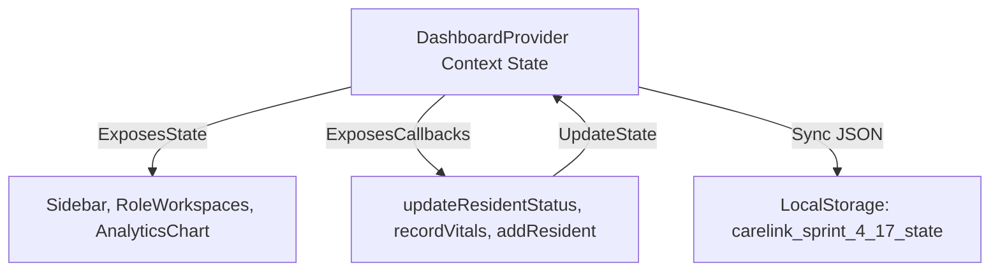

# State Management Specification

**Project:** CareLink Guardian Portal  
**Subtitle:** Healthcare Operations & Family Care Management Platform  
**Version:** 1.0  
**Prepared By:** Lakshara Anand V V  
**Register Number:** RA2411003050128  
**Project Supervisor:** Dr. Rahmath Nisha  
**Academic Year:** 2026–2027  

---

# Document Metadata

| Field | Value |
| :--- | :--- |
| **Document Version** | 1.0 |
| **Last Updated** | 2026-07-04 |
| **Prepared By** | Lakshara Anand V V |
| **Reviewed By** | Dr. Rahmath Nisha |
| **Project** | CareLink Guardian Portal |
| **Document Type** | State Management Specification |

---

# Table of Contents
- [1. Introduction](#1-introduction)
- [2. Objectives](#2-objectives)
- [3. Scope](#3-scope)
- [4. Main Content](#4-main-content)
  - [4.1 Context API Architecture](#41-context-api-architecture)
  - [4.2 Global State vs. Component Local State](#42-global-state-vs-component-local-state)
  - [4.3 State Persistence and Caching Lifecycle](#43-state-persistence-and-caching-lifecycle)
- [5. Summary](#5-summary)
- [6. Conclusion](#6-conclusion)
- [Author](#author)
- [Project Supervisor](#project-supervisor)

---

# 1. Introduction

## 1.1 Purpose
This document provides the State Management Specification for the CareLink Guardian Portal frontend application. It outlines the Context API architectures, state data allocations, hydration sequences, and serialization lifecycles.

## 1.2 Scope
The scope of this document covers global React Context variables, local component states, cache synchronization variables, and session hydration tasks.

## 1.3 Intended Audience
This technical specification is prepared for developers, quality assurance reviewers, academic supervisors, and system evaluators.

## 1.4 Relationship to the Overall Project
The State Management Specification details the runtime data coordination patterns that support the low-level functions (LLD) and routing interfaces.

---

# 2. Objectives

The primary engineering objectives of this state specification are:
- Define the Context Provider state scopes and child components bindings.
- Establish the data boundaries separating global states from local component states.
- Outline the initial session hydration sequence from LocalStorage.
- Specify the dynamic serialization lifecycle of application state updates.

---

# 3. Scope

This specification is bounded by the browser-thread client state engine:
- **Included:** React Context states, local buffers, lifecycle effect tasks, and serialization parameters.
- **Excluded:** Back-end server state management, persistent cloud caching, or remote session databases.

---

# 4. Main Content

## 4.1 Context API Architecture
The application implements a centralized client-side state engine using React's **Context API**. The `DashboardProvider` (located in `DashboardContext.jsx`) acts as the single source of truth, managing and distributing state variables to all child routes in the Next.js App Router tree.

### 4.1.1 Context State Variables
The provider initializes and tracks the following states:
*   `currentUser`: The currently authenticated user object (holds ID, name, email, role, and institution ID).
*   `data`: The application records object containing arrays for `residents`, `caregivers`, `guardians`, `notifications`, `activityHistory`, `caregiverActivityHistory`, `careLinkSyncEvents`, and `alerts`.
*   `networkMode`: Either `"online"` or `"offline"`, controlling simulated network status.
*   `simulateApiFailure`: Boolean flag to simulate API server failures.
*   `syncQueueStatus`: Status of the mock sync outbox (`"idle" | "synced" | "failed"`).
*   `toasts`: Stack of transient UI notifications.

## 4.2 Global State vs. Component Local State
To optimize performance and avoid unnecessary re-renders, state is split between global context and local component state.

### 4.2.1 Global Context State
Shared data that affects multiple views or must persist across routes:
*   **Registry Records**: The core collections of residents, caregivers, and guardians.
*   **Audit Trails**: Global activity history logs and caregiver action records.
*   **Alert Collections**: Notifications, alerts, and system configuration toggles.
*   **Outbox Sync Queue**: Pending synchronization events (`careLinkSyncEvents`).

### 4.2.2 Component Local State
Temporary data isolated to a single component:
*   **Active Workspace Tabs**: Current vitals chart selection (BP vs. Blood Sugar vs. SpO2) in `VitalsChartTabbed.jsx`.
*   **Form Input Buffers**: Inputs for adding a resident or recording care notes in `CareUpdatePanel.jsx`.
*   **UI Filters**: Search query strings, category filters, and sorting parameters in workspace directories.

## 4.3 State Persistence and Caching Lifecycle
The application uses an automatic synchronization lifecycle to maintain state persistence across page reloads.

### 4.3.1 Initial Hydration
When the portal loads in the browser:
1.  The provider schedules a microtask to read stored data.
2.  It fetches `carelinkUser` from LocalStorage to restore any active user session.
3.  It retrieves `carelink_sprint_4_17_state` to restore the application state. If empty, it falls back to the static seed data in `carelinkData.js`.
4.  The `isHydrated` state flag is set to `true`, rendering the workspace view.

### 4.3.2 Dynamic Serialization
Whenever a mutator function modifies global state (e.g., adding a resident, updating a vitals record, or completing a care task):
1.  The provider updates its internal `data` state.
2.  An effect hook catches this state change and automatically serializes the entire `data` object to JSON.
3.  The serialized JSON string is saved back to LocalStorage under the `carelink_sprint_4_17_state` key, keeping the cache current.

---

# 5. Summary

This State Management Specification outlines the Context API layout of the CareLink Guardian Portal. It details the active state variables, explains the division between global and local states, and maps the session hydration and serialization paths.

---

# 6. Conclusion

Centralizing client-side mutations inside a React Context Provider yields immediate UI updates and a responsive user experience. Implementing dual-tier caching logic provides offline continuity for clinical workflows.

---

## Author

**Lakshara Anand V V**  
Bachelor of Technology  
Computer Science and Engineering  
SRM Institute of Science and Technology  
Tiruchirappalli Campus  
Academic Year: 2026–2027  

---

## Project Supervisor

**Dr. Rahmath Nisha**  
Assistant Professor  
Department of Computer Science and Engineering  
SRM Institute of Science and Technology  
Tiruchirappalli Campus  

---

CareLink Guardian Portal  
Healthcare Operations & Family Care Management Platform  
© 2026 Lakshara Anand V V  
SRM Institute of Science and Technology  
Tiruchirappalli Campus  
