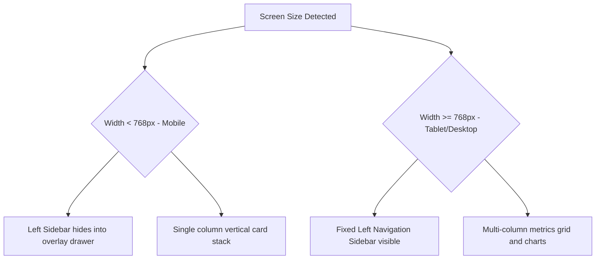

# UI/UX Design Specification

**Project:** CareLink Guardian Portal  
**Subtitle:** Healthcare Operations & Family Care Management Platform  
**Version:** 1.0  
**Prepared By:** Lakshara Anand V V  
**Register Number:** RA2411003050128  
**Project Supervisor:** Dr. Rahmath Nisha  
**Academic Year:** 2026–2027  

---

# Document Metadata

| Field | Value |
| :--- | :--- |
| **Document Version** | 1.0 |
| **Last Updated** | 2026-07-04 |
| **Prepared By** | Lakshara Anand V V |
| **Reviewed By** | Dr. Rahmath Nisha |
| **Project** | CareLink Guardian Portal |
| **Document Type** | UI/UX Design Specification |

---

# Table of Contents
- [1. Introduction](#1-introduction)
- [2. Objectives](#2-objectives)
- [3. Scope](#3-scope)
- [4. Main Content](#4-main-content)
  - [4.1 Material Design 3 (MD3) Design Language](#41-material-design-3-md3-design-language)
  - [4.2 Color System & Semantic Mapping](#42-color-system--semantic-mapping)
  - [4.3 Typography Hierarchy](#43-typography-hierarchy)
  - [4.4 Layout & Spacing System](#44-layout--spacing-system)
  - [4.5 Responsive Behavior and Breakpoints](#45-responsive-behavior-and-breakpoints)
  - [4.6 Accessibility & System Micro-Animations](#46-accessibility--system-micro-animations)
- [5. Summary](#5-summary)
- [6. Conclusion](#6-conclusion)
- [Author](#author)
- [Project Supervisor](#project-supervisor)

---

# 1. Introduction

## 1.1 Purpose
This document provides the User Interface (UI) and User Experience (UX) Design Specification for the CareLink Guardian Portal frontend application. It defines the visual identity guidelines, layout templates, typography variables, colors, and accessibility compliance targets.

## 1.2 Scope
The scope of this specification covers all visual interfaces, components, spacing guidelines, responsive behaviors, focus rings, animations, and transitions implemented across the user role workspaces.

## 1.3 Intended Audience
This document is prepared for designers, frontend developers, academic evaluators, and system reviewers checking compliance with modern UI standards.

## 1.4 Relationship to the Overall Project
The UI/UX Design Specification translates functional design scopes from the SRS into design tokens, variables, and structural classes used in component implementation.

---

# 2. Objectives

The primary visual and design objectives of this document are:
- Implement a modern, clean, and accessible design system based on Material Design 3 guidelines.
- Standardize design tokens for colors, spacing, borders, shadows, and radii in Tailwind CSS v4.
- Specify screen width breakpoints and layout adaptation rules for mobile-responsive displays.
- Define micro-animations and transitions to provide a smooth, responsive user experience.

---

# 3. Scope

This specification is bounded by the visual development tokens of the client application:
- **Included:** Elevation variable values, border radius measurements, color code maps, font hierarchies, media query breakpoints, focus outlines, and SVG waveforms.
- **Excluded:** Multi-theme engine variables (e.g. active dark-theme stylesheets) and branding assets for other ecosystem components.

---

# 4. Main Content

## 4.1 Material Design 3 (MD3) Design Language
The portal incorporates Material Design 3 inspired principles, combining clear elevation layering, rounded component boundaries, and semantic status indicators to build a professional medical interface.

### 4.1.1 Structural Foundations
*   **Elevation Layers**: Mapped to CSS variables:
    *   *Base Surface* (`--surface-base`: `#F8FAFC`): Background canvas.
    *   *Raised Cards* (`--surface-raised`: `#FFFFFF`): Layout modules, forms, charts.
    *   *Overlays / Modals* (`--surface-overlay`): Translucent white backdrop overlays (`rgba(255, 255, 255, 0.94)`) using blur settings.
*   **Corners & Radius System**:
    *   `--radius-sm` (`0.5rem` / `8px`): Buttons and input fields.
    *   `--radius-md` (`0.75rem` / `12px`): Sub-widgets and alert badges.
    *   `--radius-lg` (`1.0rem` / `16px`): Inner sections.
    *   `--radius-xl` (`1.25rem` / `20px`): Main component cards (e.g., `.md3-card`).
    *   `--radius-2xl` (`1.5rem` / `24px`): Large dialog panels and visual highlights.
    *   `--radius-full` (`9999px`): Fully rounded status pill indicators.
*   **Shadow Systems**: Mapped shadows increase progressively:
    *   `--shadow-xxs`: `0 1px 2px rgba(15, 23, 42, 0.04)`
    *   `--shadow-xs`: `0 1px 3px rgba(15, 23, 42, 0.06), 0 1px 2px rgba(15, 23, 42, 0.04)`
    *   `--shadow-sm`: `0 2px 6px rgba(15, 23, 42, 0.07), 0 1px 2px rgba(15, 23, 42, 0.04)`
    *   `--shadow-md`: `0 6px 16px rgba(15, 23, 42, 0.08), 0 2px 6px rgba(15, 23, 42, 0.05)`
    *   `--shadow-lg`: `0 12px 28px rgba(15, 23, 42, 0.1), 0 4px 10px rgba(15, 23, 42, 0.06)`
    *   `--shadow-xl`: `0 20px 42px rgba(15, 23, 42, 0.14)`
    *   `--shadow-brand`: `0 6px 18px rgba(236, 72, 153, 0.22)`

## 4.2 Color System & Semantic Mapping
The application utilizes high-contrast color families mapped directly within `src/app/globals.css`.

| Token Name | Hex Code | Semantic Role |
| :--- | :--- | :--- |
| `--color-brand-50` | `#FCE7F3` | Brand accent background |
| `--color-brand-500` | `#EC4899` | Core deep-rose brand accent |
| `--color-brand-700` | `#BE185D` | Critical high-contrast labels |
| `--color-success-50` | `#ECFDF5` | Success background accent |
| `--color-success-500` | `#10B981` | Safe/Completed status badge |
| `--color-warning-50` | `#FFFBEB` | Warning background accent |
| `--color-warning-500` | `#F59E0B` | Warning alert/Pending status |
| `--color-danger-50` | `#FEF2F2` | Danger background accent |
| `--color-danger-500` | `#EF4444` | High risk/Missed task/Emergency alert |
| `--color-info-50` | `#EEF2FF` | Informational background accent |
| `--color-info-500` | `#4F46E5` | Informational markers/Vitals metrics |
| `--color-gray-50` | `#F8FAFC` | Grid sub-elements background |
| `--color-gray-900` | `#0F172A` | Primary layout typography |

## 4.3 Typography Hierarchy
The typography structure is built using the browser system stack combined with clamp rules to adapt to mobile resolutions.

*   **System Font Stack**:
    *   `font-family: var(--font-geist-sans), Inter, ui-sans-serif, system-ui, -apple-system, BlinkMacSystemFont, "Segoe UI", sans-serif`
*   **Hero Title** (`.font-hero`): Large text styling (`clamp(2.5rem, 6vw, 4.5rem)`), weight `800`, with tight `1.03` line-height. Surfaces primary messaging on the portal landing screen.
*   **Page Header** (`.font-page-title`): `3.0rem`, weight `900`, line-height `1.1`. Surfaces title bars inside role workspaces.
*   **Section Header** (`.font-section-title`): `1.875rem`, weight `700`, line-height `1.2`. Used on sub-panels.
*   **Form Labels / Inputs** (`.md3-field`): `0.875rem` font, weight `600` for high legibility.

## 4.4 Layout & Spacing System
*   **Containers** (`.md3-container`): Mapped to a maximum width of `1400px` with centered margins (`margin-inline: auto`) and safety cushions (`padding-inline: 1.5rem`).
*   **Layout Grids**:
    *   Standard spacing utilizes mobile-first vertical stack gaps (`space-y-6`).
    *   Metric boards are laid out as CSS grids (`grid gap-4 sm:grid-cols-2 xl:grid-cols-3`).
    *   Resident details are organized in clinical grids (`medical-grid` background grid mesh pattern).
    *   Spacing blocks align with standard tailwind multiples of `4px` / `0.25rem` up to `64px` / `4rem`.

## 4.5 Responsive Behavior and Breakpoints
The design uses Tailwind CSS v4 breakpoint triggers to manage mobile layouts:

*   **Mobile Viewport (<768px)**:
    *   Global `Sidebar` collapses into a hidden overlay layout, toggled by a floating drawer trigger.
    *   Interactive layouts fall back to single-column blocks to avoid horizontal scrolling.
*   **Tablet / Desktop Viewport (>=768px)**:
    *   Sidebar locks fixed on the left margin (`w-72` or `w-80`).
    *   Main contents occupy a flexible side column with responsive gaps.

## 4.6 Accessibility & System Micro-Animations

### 4.6.1 Accessibility Guidelines (a11y)
*   **Focus Rings** (`.focus-ring`): Interactive widgets have focus rings displaying `outline: 2px solid var(--color-brand-500)` with `outline-offset: 2px` on keyboard focus.
*   **Contrast Ratios**: Body text contrasts exceed 4.5:1 against the light slate surfaces.
*   **Aria Tags**: Icon buttons incorporate labels explaining target transitions (e.g., Back buttons, edit toggles).

### 4.6.2 System Micro-Animations
*   **Page Transitions**: Sub-pages use custom transitions that smoothly shift opacity and slide vertically (`y: 10` to `y: 0` offset) to prevent harsh content jumps.
*   **Transition Variables**:
    *   `--transition-fast`: `150ms cubic-bezier(0.2, 0, 0, 1)`
    *   `--transition-base`: `200ms cubic-bezier(0.2, 0, 0, 1)`
*   **Pulse Path** (`.care-pulse-line`): System SVG lines animate an endless heart pulse waveform using `stroke-dashoffset` keyframes, providing a dynamic look.

---

# 5. Summary

This design specification details the UI/UX architecture of the CareLink Guardian Portal. It defines elevation systems, rounded borders, shadow categories, semantic colors, font hierarchies, responsive breakpoints, and system micro-animations.

---

# 6. Conclusion

The design tokens and interface guidelines documented in this specification ensure visual consistency across all workspaces of the CareLink Guardian Portal. Adhering to these tokens produces a clean, accessible, and responsive user experience.

---

## Author

**Lakshara Anand V V**  
Bachelor of Technology  
Computer Science and Engineering  
SRM Institute of Science and Technology  
Tiruchirappalli Campus  
Academic Year: 2026–2027  

---

## Project Supervisor

**Dr. Rahmath Nisha**  
Assistant Professor  
Department of Computer Science and Engineering  
SRM Institute of Science and Technology  
Tiruchirappalli Campus  

---

CareLink Guardian Portal  
Healthcare Operations & Family Care Management Platform  
© 2026 Lakshara Anand V V  
SRM Institute of Science and Technology  
Tiruchirappalli Campus  
